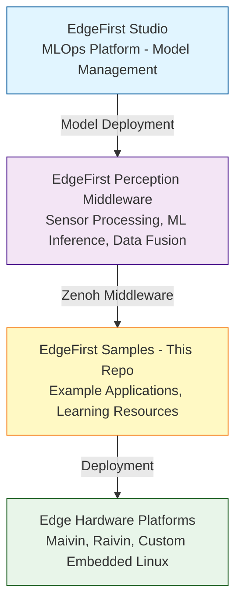

# EdgeFirst Samples Architecture

This document provides an in-depth overview of the EdgeFirst Samples repository architecture, design patterns, and implementation details. It serves as a technical guide for developers who want to understand, modify, or extend the samples.

## Table of Contents

- [Overview](#overview)
- [Technology Stack](#technology-stack)
- [Repository Structure](#repository-structure)
- [Zenoh Communication Architecture](#zenoh-communication-architecture)
- [Message Schema System](#message-schema-system)
- [Visualization with Rerun](#visualization-with-rerun)
- [Platform-Specific Implementation](#platform-specific-implementation)
- [Build System](#build-system)
- [Common Patterns](#common-patterns)
- [Extension Points](#extension-points)

---

## Overview

### Purpose

The EdgeFirst Samples repository demonstrates how to use the **EdgeFirst Perception Middleware** for edge AI and computer vision applications. It provides working examples of:

- Sensor data acquisition (camera, LiDAR, radar, IMU, GPS)
- Data serialization and communication via Zenoh
- Multi-sensor fusion
- ML inference result processing
- Real-time visualization with Rerun

### Target Audience

- Developers learning EdgeFirst Perception
- Platform integrators building edge AI systems
- Computer vision engineers working with embedded devices
- Engineers evaluating EdgeFirst for their projects

### Relationship to EdgeFirst Ecosystem



---

## Technology Stack

### Core Languages

**Rust (Primary)**
- Version: Rust 2024 edition
- Used for: All core examples, high-performance processing
- Benefits: Memory safety, zero-cost abstractions, strong type system

**Python (Secondary)**
- Version: Python 3.8+
- Used for: Alternative examples, rapid prototyping
- Benefits: Easy to learn, extensive ecosystem

### Key Dependencies

**Zenoh (Communication Middleware)**
- Version: 1.3.4
- Purpose: Pub/Sub messaging, data distribution
- Website: https://zenoh.io/
- Usage: All examples use Zenoh for sensor data communication

**Rerun (Visualization)**
- Version: 0.27.2
- Purpose: Real-time data visualization and recording
- Website: https://rerun.io/
- Usage: Optional feature flag for visualization

**edgefirst-schemas**
- Version: 1.4.0
- Purpose: Message type definitions and serialization
- License: Apache-2.0
- Usage: All message serialization/deserialization

**ROS2 CDR Serialization**
- Purpose: Message encoding/decoding
- Standard: OMG DDS-RTPS specification
- Usage: Binary serialization format for Zenoh messages

### Platform Dependencies

- **Linux:** Primary target platform (kernel 5.10+)
  - **Windows** remote message client
  - **macOS** remote message client
- **DMA buffers:** Linux-specific zero-copy camera interface
- **V4L2:** Video4Linux2 for camera access (some examples)

---

## Repository Structure

```
edgefirst-samples/
├── rust/                    # Rust implementations
│   ├── lib.rs              # Shared library (CLI args, Zenoh config)
│   ├── list-topics.rs      # Zenoh topic discovery tool
│   ├── gps.rs              # GPS example
│   ├── imu.rs              # IMU example
│   ├── camera/             # Camera examples
│   ├── lidar/              # LiDAR examples
│   ├── radar/              # Radar examples
│   ├── model/              # ML inference outputs
│   ├── fusion/             # Multi-sensor fusion
│   └── combined/           # Complex multi-topic examples
│       └── mega_sample.rs  # All topics combined
│
├── python/                 # Python implementations (parallel structure)
│   ├── list-topics.py
│   ├── gps.py
│   ├── imu.py
│   ├── camera/
│   ├── lidar/
│   ├── radar/
│   ├── model/
│   ├── fusion/
│   └── combined/
│
├── .github/
│   ├── workflows/          # CI/CD pipelines
│   └── scripts/            # SBOM generation, license checks
│
└── ...
```

---

## Zenoh Communication Architecture

### Overview

Zenoh is a pub/sub middleware designed for edge and IoT applications. EdgeFirst uses Zenoh for:

- Low-latency sensor data distribution
- Dynamic discovery (no central broker required)
- Efficient serialization (ROS2 CDR)
- Flexible deployment (local, remote, multi-machine)

### Session Management

**Configuration Pattern:**

```rust
use zenoh::config::{Config, WhatAmI};

// Create config from CLI args
let mut config = if args.connect.is_empty() {
    Config::default()
} else {
    let mut config = Config::default();
    config.connect.endpoints = args.connect.clone();
    config.scouting.multicast.set_enabled(Some(false)).unwrap();
    config
};

// Set session mode
config.set_mode(Some(WhatAmI::Client)).unwrap();

// Open session
let session = zenoh::open(config).await?;
```

**Session Modes:**
- **Client:** Connects to router/peer
- **Peer:** Participates in distributed routing
- **Router:** Acts as message broker

For most examples, **Client** mode is used.

### Topic Naming Convention

All EdgeFirst topics follow the pattern:

```
rt/<sensor>/<message_type>
```

**Examples:**
- `rt/camera/image` - Raw camera images
- `rt/camera/compressed` - Compressed images (H.264/JPEG)
- `rt/lidar/points` - LiDAR point clouds
- `rt/radar/targets` - Radar detection targets
- `rt/model/boxes2d` - 2D bounding box detections
- `rt/fusion/boxes3d` - Fused 3D bounding boxes
- `rt/imu/data` - IMU measurements
- `rt/gps/fix` - GPS position fixes

**Prefix:** `rt/` stands for "real-time"

### Subscriber Pattern

**Basic subscriber:**

```rust
let subscriber = session
    .declare_subscriber(&args.topic)
    .callback(|sample| {
        // Deserialize message
        let msg: MessageType = cdr::deserialize(&sample.payload().to_bytes()).unwrap();
        
        // Process message
        process_message(msg);
    })
    .await?;

// Keep subscriber alive
tokio::signal::ctrl_c().await?;
```

**Callback vs. Receiver:**

Most examples use **callback** style for simplicity. For more control, use **receiver** pattern:

```rust
let subscriber = session
    .declare_subscriber(&args.topic)
    .await?;

while let Ok(sample) = subscriber.recv_async().await {
    // Process sample
}
```

### Encoding Metadata

Zenoh samples include encoding metadata:

```rust
sample.encoding() // Returns encoding information
```

EdgeFirst uses:
- **application/octet-stream** - Binary ROS2 CDR encoding
- **text/plain** - JSON (for debugging/compatibility)

### Message Serialization

**Deserialization pattern:**

```rust
use cdr::{CdrLe, Infinite};

let msg: CompressedImage = match cdr::deserialize_from(
    &*sample.payload().to_bytes(),
    cdr::size::Infinite,
) {
    Ok(m) => m,
    Err(e) => {
        eprintln!("Deserialization error: {}", e);
        return;
    }
};
```

**Python deserialization:**

```python
from edgefirst_schemas import CompressedImage
import cdr

data = sample.payload.to_bytes()
msg = cdr.deserialize(data, CompressedImage)
```

---

## Message Schema System

### edgefirst-schemas

The `edgefirst-schemas` crate defines all message types used in EdgeFirst Perception:

**Common message types:**

```rust
// Camera
pub struct Image { ... }
pub struct CompressedImage { ... }
pub struct DmaBuf { ... }
pub struct CameraInfo { ... }

// LiDAR
pub struct PointCloud2 { ... }
pub struct LaserScan { ... }

// Radar
pub struct RadarTarget { ... }
pub struct RadarCluster { ... }
pub struct RadarCube { ... }

// ML Inference
pub struct BoundingBox2D { ... }
pub struct BoundingBox2DArray { ... }
pub struct BoundingBox2DTracked { ... }
pub struct Mask { ... }

// Sensor Fusion
pub struct BoundingBox3D { ... }
pub struct OccupancyGrid { ... }

// Navigation
pub struct Imu { ... }
pub struct NavSatFix { ... }  // GPS
```

### ROS2 Compatibility

EdgeFirst schemas are **ROS2-compatible** using CDR (Common Data Representation):

- Messages can interoperate with ROS2 systems
- Standard serialization format
- Well-defined message evolution rules

### Message Headers

Most messages include a standard header:

```rust
pub struct Header {
    pub stamp: Time,      // Timestamp
    pub frame_id: String, // Coordinate frame
}

pub struct Time {
    pub sec: i32,         // Seconds since epoch
    pub nanosec: u32,     // Nanoseconds
}
```

This allows:
- Temporal synchronization across sensors
- Coordinate frame transformation
- Message ordering and replay

---

## Visualization with Rerun

### Overview

Rerun (https://rerun.io/) is an optional visualization tool for time-series and spatial data. It's particularly useful for:

- Debugging sensor data
- Visualizing multi-sensor fusion
- Recording and replaying sessions
- Remote monitoring

### Integration Pattern

Rerun is an **optional feature** in the build:

```toml
[dependencies]
rerun = { version = "0.27.2", optional = true, features = ["clap"] }

[features]
default = []
rerun = ["dep:rerun"]
```

**Build with Rerun:**
```bash
cargo build --features rerun
```

**Without Rerun:**
```bash
cargo build  # Smaller binary, no visualization
```

### Logging Pattern

```rust
#[cfg(feature = "rerun")]
{
    let rec = rerun::RecordingStreamBuilder::new("edgefirst-sample")
        .spawn()?;

    // Log image
    rec.log(
        "camera/image",
        &rerun::Image::new(image_data, [height, width])
    )?;

    // Log 3D points
    rec.log(
        "lidar/points",
        &rerun::Points3D::new(points)
    )?;

    // Log bounding boxes
    rec.log(
        "model/boxes",
        &rerun::Boxes2D::from_centers_and_sizes(centers, sizes)
    )?;
}
```

### Entity Paths

Rerun uses hierarchical entity paths:

```
camera/
  ├── image         # Camera image
  └── info          # Camera calibration

lidar/
  ├── points        # Point cloud
  └── clusters      # Clustered points

model/
  ├── boxes2d       # Detections
  └── masks         # Segmentation

fusion/
  ├── boxes3d       # 3D boxes
  └── occupancy     # Occupancy grid
```

### Remote Viewing

Rerun supports remote viewing:

```bash
# On edge device
cargo run --bin camera-dma --features rerun -- --rerun-addr 192.168.1.100:9876

# On developer workstation
rerun --port 9876
```

### Recording Sessions

Save sessions to `.rrd` files:

```bash
cargo run --bin mega_sample --features rerun -- --save-rerun session.rrd

# Later replay:
rerun session.rrd
```

---

## Platform-Specific Implementation

### Linux-Only Features

Several examples use **Linux-specific APIs**:

**DMA Buffers (camera/dma.rs):**
```rust
#[cfg(target_os = "linux")]
use std::os::unix::io::{AsRawFd, FromRawFd};

// Zero-copy camera access via DMA
let fd = dma_buf.fd;
let file = unsafe { File::from_raw_fd(fd) };
```

**pidfd (process signaling):**
```rust
#[cfg(target_os = "linux")]
use rustix::process::pidfd_open;
```

### Cross-Platform Considerations

When adding new examples:

- Use `#[cfg(target_os = "linux")]` for Linux-specific code
- Provide graceful degradation or alternatives for other platforms
- Document platform requirements in README
- Test on x86_64 and ARM64 if possible

### Hardware Dependencies

Some examples require specific hardware:

- **camera/dma.rs** - Requires V4L2 camera with DMA support
- **lidar/*.rs** - Requires LiDAR sensor publishing to Zenoh
- **radar/*.rs** - Requires radar sensor

For development without hardware, use:
- **list-topics.rs** - Works with any Zenoh session
- Mock data publishers (future addition)
- Recorded `.rrd` files

---

## Build System

### Cargo Workspace

The project uses a **Cargo workspace** with multiple binaries:

```toml
[package]
name = "edgefirst-samples"
version = "0.0.0"
edition = "2024"
license = "Apache-2.0"

[lib]
name = "edgefirst_samples"
path = "rust/lib.rs"

[[bin]]
name = "camera-dma"
path = "rust/camera/dma.rs"

[[bin]]
name = "lidar-points"
path = "rust/lidar/points.rs"

# ... more binaries
```

### Shared Library (lib.rs)

The `lib.rs` provides shared functionality:

**CLI Arguments:**
```rust
#[derive(Parser)]
pub struct Args {
    #[clap(short, long)]
    pub topic: String,

    #[clap(short, long)]
    pub connect: Vec<String>,

    // ... more args
}
```

**Zenoh Config Generation:**
```rust
pub fn create_zenoh_config(args: &Args) -> Config {
    // Common config logic
}
```

All binaries use this library to avoid code duplication.

### Feature Flags

**Current features:**

```toml
[features]
default = []
rerun = ["dep:rerun"]
```

### Cross-Compilation

**For ARM64:**

```bash
# Using cross
cross build --target aarch64-unknown-linux-gnu --release

# Or native toolchain
cargo build --target aarch64-unknown-linux-gnu --release
```

---

## Common Patterns

### Error Handling

**Examples use `anyhow` for error handling:**

```rust
use anyhow::{Context, Result};

fn main() -> Result<()> {
    let session = zenoh::open(config)
        .await
        .context("Failed to open Zenoh session")?;
    
    Ok(())
}
```

### Async Runtime

**Tokio for async execution:**

```rust
#[tokio::main]
async fn main() -> Result<()> {
    // Async code
}
```

### Graceful Shutdown

**Handle Ctrl+C:**

```rust
tokio::signal::ctrl_c()
    .await
    .context("Failed to wait for Ctrl+C")?;

println!("Shutting down...");
Ok(())
```

### Performance Profiling

Some examples include **Tracy** integration:

```rust
#[cfg(feature = "tracy")]
tracy_client::set_thread_name("main");

#[cfg(feature = "tracy")]
let _span = tracy_client::span!("process_frame");
```

Enable with:
```bash
cargo build --features tracy
```

---

## Extension Points

### Adding New Sensor Examples

**Steps:**

1. **Choose message type** from edgefirst-schemas
2. **Create new binary** in `rust/<sensor>/` or `python/<sensor>/`
3. **Define topic name** following `rt/<sensor>/<type>` convention
4. **Implement subscriber** using callback pattern
5. **Add deserialization** for message type
6. **Optional:** Add Rerun visualization
7. **Document** in README
8. **Add to Cargo.toml** as new `[[bin]]`

**Template:**

```rust
// SPDX-License-Identifier: Apache-2.0
// Copyright © 2025 Au-Zone Technologies. All Rights Reserved.

use anyhow::{Context, Result};
use edgefirst_samples::Args;
use edgefirst_schemas::YourMessageType;
use clap::Parser;
use zenoh::config::{Config, WhatAmI};

#[tokio::main]
async fn main() -> Result<()> {
    let args = Args::parse();
    
    let mut config = Config::default();
    let session = zenoh::open(config).await?;
    
    let subscriber = session
        .declare_subscriber(&args.topic)
        .callback(|sample| {
            let msg: YourMessageType = cdr::deserialize(
                &sample.payload().to_bytes()
            ).unwrap();
            
            process_message(msg);
        })
        .await?;
    
    tokio::signal::ctrl_c().await?;
    Ok(())
}

fn process_message(msg: YourMessageType) {
    // Your processing logic
}
```

### Custom Message Types

If adding **custom message types** to edgefirst-schemas:

1. Define message struct with `serde` derives
2. Ensure ROS2 CDR compatibility
3. Add to schema crate and bump version
4. Update samples to use new message type
5. Document message semantics

### Alternative Visualization

To integrate visualizers other than Rerun:

1. Add as optional dependency
2. Create feature flag
3. Use `#[cfg(feature = "your-viz")]`
4. Document usage in README

### Integration with Other Middleware

EdgeFirst examples focus on Zenoh, but you could integrate:

- **ROS2:** Bridge Zenoh ↔ ROS2 topics
- **MQTT:** Bridge Zenoh ↔ MQTT
- **DDS:** Use Zenoh-DDS bridge
- **Custom protocols:** Write Zenoh plugins

---

## Performance Considerations

### Zero-Copy Patterns

**DMA buffers:** Use `camera/dma.rs` pattern for zero-copy camera access

```rust
// Avoid copying pixel data
let dma_fd = msg.fd;
let mmap = unsafe { /* mmap the fd */ };
// Process directly from mapped memory
```

### Memory Management

- Reuse buffers where possible
- Use `Vec::with_capacity()` for known sizes
- Profile with `cargo flamegraph` or Tracy

### Latency Optimization

- Use **async** for I/O-bound operations
- Use **threads** for CPU-bound operations
- Minimize allocations in hot paths
- Consider `#[inline]` for critical functions

---

## Security Considerations

### Zenoh Security

For production deployments:

- Enable **TLS** for Zenoh communication
- Use **authentication** for Zenoh sessions
- Configure **access control** for topics
- See: https://zenoh.io/docs/manual/security/

### Input Validation

Examples prioritize clarity over robustness. Production code should:

- Validate all deserialized messages
- Check array bounds before access
- Handle malformed data gracefully
- Sanitize any user-provided input

### DMA Buffer Safety

DMA buffer examples use **unsafe** for file descriptor manipulation. Ensure:

- File descriptors are valid before use
- Memory mappings are properly released
- Lifetime management is correct

---

## Contributing

See [CONTRIBUTING.md](CONTRIBUTING.md) for guidelines on:

- Code style and conventions
- Pull request process
- Testing requirements
- Documentation standards

---

## References

### External Documentation

- **EdgeFirst Docs:** https://doc.edgefirst.ai/
- **Zenoh Docs:** https://zenoh.io/docs/
- **Rerun Docs:** https://rerun.io/docs
- **ROS2 Docs:** https://docs.ros.org/
- **Rust API Guidelines:** https://rust-lang.github.io/api-guidelines/

---

**Last Updated:** 2025-11-18  
**Version:** 1.0  
**Maintainers:** Au-Zone Technologies
