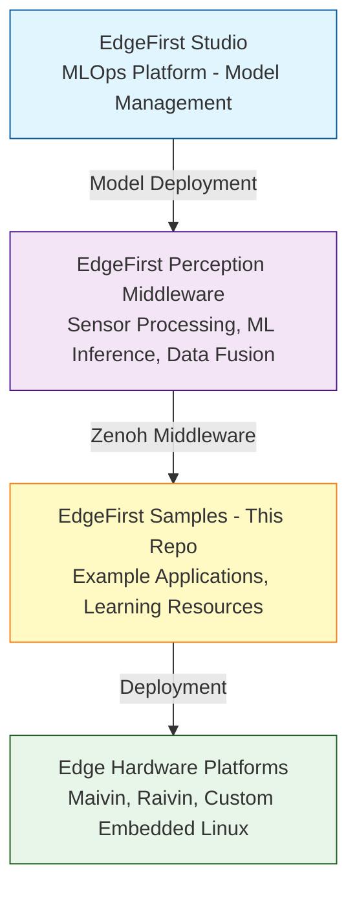

# EdgeFirst Samples Architecture

This document provides an in-depth overview of the EdgeFirst Samples repository architecture, design patterns, and implementation details. It serves as a technical guide for developers who want to understand, modify, or extend the samples.

## Table of Contents

- [Overview](#overview)
- [Technology Stack](#technology-stack)
- [Repository Structure](#repository-structure)
- [Zenoh Communication Architecture](#zenoh-communication-architecture)
- [Message Schema System](#message-schema-system)
- [Visualization with Rerun](#visualization-with-rerun)
- [Platform-Specific Implementation](#platform-specific-implementation)
- [Build System](#build-system)
- [Common Patterns](#common-patterns)
- [Extension Points](#extension-points)
- [Performance Considerations](#performance-considerations)
- [Security Considerations](#security-considerations)
- [Contributing](#contributing)
- [References](#references)

---

## Overview

### Purpose

The EdgeFirst Samples repository demonstrates how to use the **EdgeFirst Perception Middleware** for edge AI and computer vision applications. It provides working examples of:

- Sensor data acquisition (camera, LiDAR, radar, IMU, GPS)
- Data serialization and communication via Zenoh
- Multi-sensor fusion
- ML inference result processing
- Real-time visualization with Rerun

### Target Audience

- Developers learning EdgeFirst Perception
- Platform integrators building edge AI systems
- Computer vision engineers working with embedded devices
- Engineers evaluating EdgeFirst for their projects

### Relationship to EdgeFirst Ecosystem


```mermaid
graph TD
    A[EdgeFirst Studio<br/>MLOps Platform - Model Management]
    B[EdgeFirst Perception Middleware<br/>Sensor Processing, ML Inference, Data Fusion]
    C[EdgeFirst Samples - This Repo<br/>Example Applications, Learning Resources]
    D[Edge Hardware Platforms<br/>Maivin, Raivin, Custom Embedded Linux]

    A -->|Model Deployment| B
    B -->|Zenoh Middleware| C
    C -->|Deployment| D

    style A fill:#e1f5ff,stroke:#01579b
    style B fill:#f3e5f5,stroke:#4a148c
    style C fill:#fff9c4,stroke:#f57f17
    style D fill:#e8f5e9,stroke:#1b5e20
```

---

## Technology Stack

### Core Languages

**Rust (Primary)**
- Edition: 2024 (requires Rust 1.85+)
- Used for: All core examples, high-performance processing
- Benefits: Memory safety, zero-cost abstractions, strong type system

**Python (Secondary)**
- Version: Python 3.8+
- Used for: Alternative examples, rapid prototyping
- Benefits: Easy to learn, extensive ecosystem

### Key Dependencies

**Zenoh (Communication Middleware)**
- Version: 1.3.4
- Purpose: Pub/Sub messaging, data distribution
- Website: https://zenoh.io/
- Usage: All examples use Zenoh for sensor data communication

**Rerun (Visualization)**
- Version: 0.27.2
- Purpose: Real-time data visualization and recording
- Website: https://rerun.io/
- Usage: Optional feature flag for visualization (enabled by default)

**edgefirst-schemas**
- Version: 2.2.0
- Purpose: Zero-copy CDR message type definitions and serialization
- License: Apache-2.0
- Usage: All message serialization/deserialization

**ROS2 CDR Serialization**
- Purpose: Message encoding/decoding
- Standard: OMG DDS-RTPS specification
- Usage: Binary serialization format for Zenoh messages

**Additional Dependencies**
- **clap** (4.5.52): Command-line argument parsing with derive macros
- **openh264**: H.264 video decoding for camera streams
- **ndarray**: N-dimensional array processing for segmentation masks
- **colorous**: Color mapping for point cloud visualization
- **tokio**: Async runtime (with `rt` feature)
- **serde_json**: JSON serialization for Zenoh config
- **itertools**: Iterator utilities

### Platform Dependencies

- **Linux:** Primary target platform (kernel 5.10+)
  - **Windows:** Remote message client
  - **macOS:** Remote message client
- **DMA buffers:** Linux-specific zero-copy camera interface
  - `async-pidfd`, `pidfd_getfd`, `libc` (Linux-only dependencies)

---

## Repository Structure

```
edgefirst-samples/
├── rust/                       # Rust implementations
│   ├── lib.rs                  # Shared library (Args struct, Zenoh config)
│   ├── list-topics.rs          # Zenoh topic discovery tool
│   ├── gps.rs                  # GPS/NavSatFix subscriber
│   ├── imu.rs                  # IMU orientation subscriber
│   ├── camera/                 # Camera examples
│   │   ├── camera_info.rs      # Camera calibration info
│   │   ├── dma.rs              # DMA zero-copy buffers (Linux-only)
│   │   └── h264.rs             # H.264 stream decoding
│   ├── lidar/                  # LiDAR examples
│   │   ├── points.rs           # 3D point cloud
│   │   └── clusters.rs         # Clustered point cloud
│   ├── radar/                  # Radar examples
│   │   ├── targets.rs          # Radar target detections
│   │   ├── clusters.rs         # Radar clusters
│   │   ├── cube.rs             # Range-Doppler-Azimuth cube
│   │   └── info.rs             # Radar configuration
│   ├── model/                  # ML inference output examples
│   │   ├── boxes2d.rs          # 2D bounding boxes (unified Model type)
│   │   ├── boxes2d_tracked.rs  # Tracked 2D boxes with persistent IDs
│   │   ├── mask.rs             # Segmentation mask (unified Model type)
│   │   └── model_info.rs       # Model metadata
│   ├── fusion/                 # Multi-sensor fusion examples
│   │   ├── boxes3d.rs          # 3D bounding boxes
│   │   ├── occupancy.rs        # Occupancy grid
│   │   ├── model_output.rs     # Fused model output (segmentation)
│   │   ├── model_output_tracked.rs  # Fused tracked model output
│   │   ├── lidar.rs            # Fused LiDAR point cloud
│   │   └── radar.rs            # Fused radar point cloud
│   └── combined/               # Multi-topic examples
│       └── mega_sample.rs      # Complete pipeline demo
│
├── python/                     # Python implementations (parallel structure)
│   ├── list-topics.py
│   ├── gps.py
│   ├── imu.py
│   ├── camera/                 # camera_info, dma, h264, jpeg
│   ├── lidar/                  # points, clusters, depth, reflect
│   ├── radar/                  # targets, clusters, cube, info
│   ├── model/                  # boxes2d, boxes2d_tracked, mask, compressed_mask, model_info
│   ├── fusion/                 # boxes3d, occupancy, model_output, model_output_tracked, lidar, radar
│   └── combined/               # mega_sample, camera_model, camera_lidar, camera_radar
│
├── .github/
│   ├── workflows/              # CI/CD pipelines
│   └── scripts/                # SBOM generation, license checks
│
└── ...
```

**Note:** Python has additional combined examples (`camera_lidar.py`, `camera_radar.py`, `camera_model.py`) and a JPEG camera example (`camera/jpeg.py`) that do not yet have Rust equivalents. Python also retains `lidar/depth.py`, `lidar/reflect.py`, and `model/compressed_mask.py` which have been removed from the Rust side.

---

## Zenoh Communication Architecture

### Overview

Zenoh is a pub/sub middleware designed for edge and IoT applications. EdgeFirst uses Zenoh for:

- Low-latency sensor data distribution
- Dynamic discovery (no central broker required)
- Efficient serialization (ROS2 CDR)
- Flexible deployment (local, remote, multi-machine)

### Session Management

**Configuration via `Args` struct:**

The shared `Args` struct in `lib.rs` implements `From<Args> for zenoh::Config`, converting CLI arguments into a Zenoh configuration using `insert_json5`:

```rust
use clap::Parser as _;
use edgefirst_samples::Args;

let args = Args::parse();
let session = zenoh::open(args.clone()).await.unwrap();
```

Under the hood, `From<Args> for Config` builds the configuration:

```rust
impl From<Args> for Config {
    fn from(args: Args) -> Self {
        let mut config = Config::default();
        config.insert_json5("mode", &json!(args.mode).to_string()).unwrap();

        if !args.remote.is_empty() {
            config.insert_json5("connect/endpoints", &json!(args.remote).to_string()).unwrap();
        }

        if !args.listen.is_empty() {
            config.insert_json5("listen/endpoints", &json!(args.listen).to_string()).unwrap();
        }

        if args.no_multicast_scouting {
            config.insert_json5("scouting/multicast/enabled", &json!(false).to_string()).unwrap();
        }

        config.insert_json5("scouting/multicast/interface", &json!("lo").to_string()).unwrap();
        config
    }
}
```

**CLI Arguments:**

| Flag | Description | Default |
|------|-------------|---------|
| `--mode` | Zenoh connection mode (peer/client/router) | `peer` |
| `--remote` / `-r` | Remote Zenoh endpoints to connect to | (none) |
| `--listen` / `-l` | Zenoh endpoints to listen on | (none) |
| `--no-multicast-scouting` | Disable multicast discovery | `false` |

Plus Rerun-specific flags injected by `rerun::clap::RerunArgs` when the `rerun` feature is enabled.

**Session Modes:**
- **Peer:** Participates in distributed routing (default)
- **Client:** Connects to router/peer
- **Router:** Acts as message broker

### Topic Naming Convention

All EdgeFirst topics follow the pattern:

```
rt/<sensor>/<message_type>
```

**Current topics:**

| Topic | Description |
|-------|-------------|
| `rt/camera/h264` | H.264 compressed video stream |
| `rt/camera/dma` | Zero-copy DMA camera buffers |
| `rt/camera/info` | Camera calibration/info |
| `rt/model/output` | Unified ML model output (detections + masks) |
| `rt/model/info` | Model metadata |
| `rt/lidar/points` | LiDAR 3D point cloud |
| `rt/lidar/clusters` | Clustered LiDAR points |
| `rt/radar/targets` | Radar target detections |
| `rt/radar/clusters` | Radar clustered points |
| `rt/radar/cube` | Range-Doppler-Azimuth cube |
| `rt/radar/info` | Radar configuration |
| `rt/fusion/boxes3d` | Fused 3D bounding boxes |
| `rt/fusion/occupancy` | Occupancy grid |
| `rt/fusion/model_output` | Fused model output (segmentation) |
| `rt/fusion/model_output/tracked` | Fused tracked model output |
| `rt/fusion/lidar` | Fused LiDAR point cloud |
| `rt/fusion/radar` | Fused radar point cloud |
| `rt/imu` | IMU measurements |
| `rt/gps` | GPS position fixes |

**Prefix:** `rt/` stands for "real-time"

**Wildcard:** `rt/**` matches all EdgeFirst topics (used by `list-topics` and `mega-sample`)

### Subscriber Pattern

All examples use the **receiver** pattern with `recv_async()` in a loop:

```rust
let subscriber = session.declare_subscriber("rt/gps").await.unwrap();

while let Ok(msg) = subscriber.recv_async().await {
    let bytes = msg.payload().to_bytes();
    let gps = NavSatFix::from_cdr(&bytes)?;
    // Process message...
}
```

For synchronous blocking reception (used in `list-topics` and `mega-sample` topic discovery):

```rust
let subscriber = session.declare_subscriber("rt/**").await.unwrap();

while let Ok(msg) = subscriber.recv() {
    // Process message...
}
```

### Encoding Metadata

Zenoh samples include encoding metadata used for topic discovery:

```rust
let schema = msg.encoding().to_string();
let schema = schema.splitn(2, ';').last().unwrap_or_default();
println!("topic: {} -> {}", msg.key_expr(), schema);
```

---

## Message Schema System

### edgefirst-schemas (v2.2.0)

The `edgefirst-schemas` crate provides zero-copy CDR message types. Messages wrap borrowed byte buffers and expose fields via accessor methods.

**Deserialization pattern:**

```rust
let bytes = msg.payload().to_bytes();
let data = NavSatFix::from_cdr(&bytes)?;  // Zero-copy: borrows from bytes
println!("lat={} lon={}", data.latitude(), data.longitude());
```

**Key rules:**
- Use `Type::from_cdr(&bytes)?` for deserialization (not `cdr::deserialize`)
- The `bytes` variable must outlive the deserialized view
- Top-level fields use accessor methods: `msg.field()` not `msg.field`
- Inner/nested types (e.g., box fields from `model.boxes()`) use direct public fields

### Message Type Locations

| Module | Types | Description |
|--------|-------|-------------|
| `sensor_msgs` | `Image`, `CompressedImage`, `Imu`, `NavSatFix`, `PointCloud2`, `CameraInfo` | Standard sensor messages |
| `edgefirst_msgs` | `Model`, `Detect`, `Mask`, `DmaBuffer`, `RadarCube`, `RadarInfo`, `ModelInfo` | EdgeFirst-specific messages |
| `foxglove_msgs` | `FoxgloveCompressedVideo` | Foxglove video format |
| `sensor_msgs::pointcloud` | `DynPointCloud` | Zero-copy point cloud access |

**Notable types:**
- **`Model`** is the unified type for ML inference output, containing both detections (`.boxes()`) and segmentation masks (`.masks()`). It is used on `rt/model/output` and replaces the legacy separate `boxes2d` and `mask` topics.
- **`Detect`** is the legacy/fusion detection type used on `rt/fusion/boxes3d`.
- **`Mask`** (from `edgefirst_msgs`) is the fusion segmentation type used on `rt/fusion/model_output`.

### PointCloud2 and DynPointCloud

For `PointCloud2` messages (LiDAR and radar), use the zero-copy `DynPointCloud` API:

```rust
use edgefirst_schemas::sensor_msgs::{PointCloud2, pointcloud::DynPointCloud};

let pcd = PointCloud2::from_cdr(&bytes)?;
let cloud = DynPointCloud::from_pointcloud2(&pcd)?;

for point in cloud.iter() {
    let x = point.read_f32("x").unwrap_or(0.0);
    let y = point.read_f32("y").unwrap_or(0.0);
    let z = point.read_f32("z").unwrap_or(0.0);
    // Additional fields: point.read_u32("id"), point.read_f64("field"), etc.
}
```

This API is used by `lidar/points.rs`, `lidar/clusters.rs`, `radar/targets.rs`, `radar/clusters.rs`, and the mega sample.

### ROS2 Compatibility

EdgeFirst schemas are **ROS2-compatible** using CDR (Common Data Representation):

- Messages can interoperate with ROS2 systems
- Standard serialization format
- Well-defined message evolution rules

---

## Visualization with Rerun

### Overview

Rerun (https://rerun.io/) is an optional visualization tool for time-series and spatial data. It is particularly useful for:

- Debugging sensor data
- Visualizing multi-sensor fusion
- Recording and replaying sessions
- Remote monitoring

### Feature Flag

Rerun is enabled by **default** in the build:

```toml
[features]
default = ["rerun"]
rerun = ["dep:rerun"]
```

Most binary targets have `required-features = ["rerun"]`, meaning they require the Rerun feature. Only `list-topics` and `radar-info` work without Rerun.

**Build with Rerun (default):**
```bash
cargo build --release
```

**Build without Rerun:**
```bash
cargo build --release --no-default-features
```

### Initialization Pattern

Rerun is initialized via the `RerunArgs` embedded in the shared `Args` struct:

```rust
let args = Args::parse();
let (rr, _serve_guard) = args.rerun.init("sample-name")?;
```

This returns a `RecordingStream` (`rr`) and a serve guard. The `_serve_guard` must be kept alive for the duration of the program.

### Logging Examples

**Images (H.264 decoded):**
```rust
let image = rerun::Image::from_rgb24(rgb_data, [width, height]);
rr.log("image", &image)?;
```

**DMA camera (YUYV format):**
```rust
let rr_image = rerun::Image::from_pixel_format(
    [width, height],
    rerun::PixelFormat::YUY2,
    pixel_data,
);
rr.log("camera/dma", &rr_image)?;
```

**2D bounding boxes:**
```rust
rr.log(
    "boxes",
    &rerun::Boxes2D::from_centers_and_sizes(&centers, &sizes)
        .with_labels(labels.iter().map(|s| s.as_str())),
)?;
```

**3D bounding boxes:**
```rust
let rr_boxes = rerun::Boxes3D::from_centers_and_sizes(
    boxes.iter().map(|b| (b.distance, -b.center_x, -b.center_y)),
    boxes.iter().map(|b| (b.width, b.width, b.height)),
);
rr.log("fusion/boxes3d", &rr_boxes)?;
```

**3D point clouds:**
```rust
let points = rerun::Points3D::new(cloud.iter().map(|p| {
    rerun::Position3D::new(
        p.read_f32("x").unwrap_or(0.0),
        p.read_f32("y").unwrap_or(0.0),
        p.read_f32("z").unwrap_or(0.0),
    )
}));
rr.log("lidar/points", &points)?;
```

**GPS geo-points:**
```rust
rr.log(
    "CurrentLoc",
    &rerun::GeoPoints::from_lat_lon([(gps.latitude(), gps.longitude())]),
)?;
```

**IMU orientation (quaternion on 3D box):**
```rust
let pose = rerun::Quaternion([x, y, z, w]);
rr.log("box", &rerun::Transform3D::default().with_quaternion(pose))?;
```

**Segmentation masks:**
```rust
rr.log_static("/", &AnnotationContext::new([
    (0, "background", rerun::Rgba32::from_rgb(0, 0, 0)),
    (1, "person", rerun::Rgba32::from_rgb(0, 255, 0)),
]))?;
rr.log("mask", &SegmentationImage::try_from(argmax_array)?)?;
```

**Scalars (metrics):**
```rust
rr.log("/metrics/detection_inference", &rerun::archetypes::Scalars::new([total_time]))?;
```

**Text logs:**
```rust
rr.log("CameraInfo", &rerun::TextLog::new(text))?;
```

### Entity Paths

Rerun uses hierarchical entity paths. The samples use paths like:

```
/camera          # Camera image
camera/dma       # DMA camera image
image            # H.264 decoded image
lidar/points     # LiDAR point cloud
radar/targets    # Radar targets
boxes            # 2D detection boxes
mask             # Segmentation mask
fusion/boxes3d   # 3D bounding boxes
CurrentLoc       # GPS location
box              # IMU orientation box
CameraInfo       # Camera info text
ModelInfo        # Model info text
```

In the mega sample, paths use a leading `/` for hierarchical grouping:
```
/camera           # Video feed
/camera/boxes2d   # Overlaid detections
/pointcloud/lidar # LiDAR point cloud
/pointcloud/radar # Radar point cloud
/pointcloud/boxes3d  # 3D boxes
/gps              # GPS location
/metrics/detection_inference  # Inference timing
```

---

## Platform-Specific Implementation

### Linux-Only Features

Several examples use **Linux-specific APIs**:

**DMA Buffers (`camera/dma.rs`):**

The DMA example accesses camera frames via zero-copy memory-mapped file descriptors shared between processes:

```rust
#![cfg_attr(not(target_os = "linux"), allow(dead_code, unused_imports))]

use async_pidfd::PidFd;
use libc::{MAP_SHARED, PROT_READ, PROT_WRITE, mmap, munmap};
use pidfd_getfd::{GetFdFlags, get_file_from_pidfd};

// Get process file descriptor from DMA buffer's source PID
let pidfd = PidFd::from_pid(dma_buf.pid() as i32)?;
let fd = get_file_from_pidfd(pidfd.as_raw_fd(), dma_buf.fd(), GetFdFlags::empty())?;

// Memory-map the DMA buffer for zero-copy pixel access
let mmap = unsafe {
    from_raw_parts_mut(
        mmap(null_mut(), image_size, PROT_READ | PROT_WRITE, MAP_SHARED, fd.as_raw_fd(), 0) as *mut u8,
        image_size,
    )
};
// Process pixels directly from mapped memory, then unmap
unsafe { munmap(mmap.as_mut_ptr() as *mut c_void, image_size); }
```

**Non-Linux fallback:**
```rust
#[cfg(not(target_os = "linux"))]
#[tokio::main]
async fn main() {
    eprintln!("Only Linux is supported for camera DMA example");
}
```

### Cross-Platform Considerations

When adding new examples:

- Use `#[cfg(target_os = "linux")]` for Linux-specific code
- Provide a non-Linux `main()` fallback that prints a clear message
- Use `#![cfg_attr(not(target_os = "linux"), allow(dead_code, unused_imports))]` at crate level
- Document platform requirements in README
- Test on x86_64 and aarch64 if possible

### Hardware Dependencies

Some examples require specific hardware:

- **camera/dma.rs** -- Requires V4L2 camera with DMA support, must run on-device
- **camera/h264.rs** -- Requires H.264 camera stream
- **lidar/*.rs** -- Requires LiDAR sensor publishing to Zenoh
- **radar/*.rs** -- Requires radar sensor

For development without hardware, use:
- **list-topics** -- Works with any Zenoh session
- **radar-info** -- Prints radar config and exits
- Recorded data replayed through Zenoh

---

## Build System

### Cargo Package

The project is a single Cargo package with a shared library and multiple binary targets:

```toml
[package]
name = "edgefirst-samples"
version = "0.1.2"
edition = "2024"
license = "Apache-2.0"
publish = false

[lib]
name = "edgefirst_samples"
path = "rust/lib.rs"
```

### Binary Targets

Each sample is a separate `[[bin]]` entry. Most require the `rerun` feature:

```toml
[[bin]]
name = "gps"
path = "rust/gps.rs"
required-features = ["rerun"]

[[bin]]
name = "list-topics"
path = "rust/list-topics.rs"
# No required-features -- works without Rerun

[[bin]]
name = "radar-info"
path = "rust/radar/info.rs"
# No required-features -- works without Rerun
```

**All binary targets:**

| Binary | Source | Requires Rerun |
|--------|--------|:-:|
| `list-topics` | `rust/list-topics.rs` | No |
| `radar-info` | `rust/radar/info.rs` | No |
| `gps` | `rust/gps.rs` | Yes |
| `imu` | `rust/imu.rs` | Yes |
| `camera-dma` | `rust/camera/dma.rs` | Yes |
| `camera-info` | `rust/camera/camera_info.rs` | Yes |
| `camera-h264` | `rust/camera/h264.rs` | Yes |
| `lidar-points` | `rust/lidar/points.rs` | Yes |
| `lidar-clusters` | `rust/lidar/clusters.rs` | Yes |
| `radar-targets` | `rust/radar/targets.rs` | Yes |
| `radar-clusters` | `rust/radar/clusters.rs` | Yes |
| `radar-cube` | `rust/radar/cube.rs` | Yes |
| `model-boxes` | `rust/model/boxes2d.rs` | Yes |
| `model-boxes_tracked` | `rust/model/boxes2d_tracked.rs` | Yes |
| `model-mask` | `rust/model/mask.rs` | Yes |
| `model-info` | `rust/model/model_info.rs` | Yes |
| `fusion-boxes3d` | `rust/fusion/boxes3d.rs` | Yes |
| `fusion-occupancy` | `rust/fusion/occupancy.rs` | Yes |
| `fusion-model-output` | `rust/fusion/model_output.rs` | Yes |
| `fusion-model-output-tracked` | `rust/fusion/model_output_tracked.rs` | Yes |
| `fusion-lidar` | `rust/fusion/lidar.rs` | Yes |
| `fusion-radar` | `rust/fusion/radar.rs` | Yes |
| `mega-sample` | `rust/combined/mega_sample.rs` | Yes |

### Shared Library (`lib.rs`)

The shared library defines the `Args` struct used by all binaries:

```rust
#[derive(Parser, Debug, Clone)]
#[command(author, version, about, long_about = None)]
pub struct Args {
    #[cfg(feature = "rerun")]
    #[command(flatten)]
    pub rerun: rerun::clap::RerunArgs,

    #[arg(long, default_value = "peer")]
    pub mode: WhatAmI,

    #[arg(short, long)]
    pub remote: Vec<String>,

    #[arg(short, long)]
    pub listen: Vec<String>,

    #[arg(long)]
    pub no_multicast_scouting: bool,
}

impl From<Args> for Config { ... }  // Converts to Zenoh config via insert_json5
```

### Feature Flags

```toml
[features]
default = ["rerun"]
rerun = ["dep:rerun"]
```

The `rerun` feature is **on by default**. Disable with `--no-default-features` for smaller binaries on headless deployments.

### Release Profile

Optimized release builds are configured for embedded deployment:

```toml
[profile.release]
lto = true           # Link-time optimization
codegen-units = 1    # Single codegen unit for better optimization
strip = true         # Strip debug symbols for smaller binaries
```

### Cross-Compilation

**For ARM64:**

```bash
# Using cross
cross build --target aarch64-unknown-linux-gnu --release

# Or native toolchain
cargo build --target aarch64-unknown-linux-gnu --release
```

---

## Common Patterns

### Error Handling

Examples use `Box<dyn Error>` for error handling (not `anyhow`):

```rust
use std::error::Error;

#[tokio::main]
async fn main() -> Result<(), Box<dyn Error>> {
    let args = Args::parse();
    let session = zenoh::open(args.clone()).await.unwrap();
    let subscriber = session.declare_subscriber("rt/gps").await.unwrap();
    let (rr, _serve_guard) = args.rerun.init("gps")?;

    while let Ok(msg) = subscriber.recv_async().await {
        let bytes = msg.payload().to_bytes();
        let gps = NavSatFix::from_cdr(&bytes)?;
        rr.log("CurrentLoc", &rerun::GeoPoints::from_lat_lon([(gps.latitude(), gps.longitude())]))?;
    }

    Ok(())
}
```

**Conventions:**
- CDR deserialization uses `?` for error propagation
- Zenoh session and subscriber creation use `.unwrap()` (fatal if they fail)
- Rerun initialization uses `?`
- Rerun logging uses `?`
- The mega sample uses `match` with `eprintln!` + `continue` for more graceful error handling in multi-topic scenarios

### Async Runtime

All examples use Tokio as the async runtime:

```rust
#[tokio::main]
async fn main() -> Result<(), Box<dyn Error>> {
    // ...
}
```

The mega sample uses `tokio::task::spawn` for concurrent topic handlers:

```rust
let rr = Arc::new(rr);

if camera_topics.contains("rt/camera/h264") {
    let sub = session.declare_subscriber("rt/camera/h264").await.unwrap();
    task::spawn(camera_h264_handler(sub, rr.clone()));
}
```

### Graceful Shutdown

The mega sample uses `Ctrl+C` for graceful shutdown:

```rust
tokio::signal::ctrl_c().await?;
Ok(())
```

Simpler samples rely on the subscriber loop ending naturally or being interrupted.

### Import Convention

Samples import `clap::Parser` as an unnamed trait to bring `Args::parse()` into scope without polluting the namespace:

```rust
use clap::Parser as _;
use edgefirst_samples::Args;
```

---

## Extension Points

### Adding New Sensor Examples

**Steps:**

1. **Choose message type** from edgefirst-schemas
2. **Create new binary** in `rust/<sensor>/`
3. **Define topic name** following `rt/<sensor>/<type>` convention
4. **Implement subscriber** using the receiver pattern
5. **Deserialize** with `Type::from_cdr(&bytes)?`
6. **Optional:** Add Rerun visualization
7. **Add to Cargo.toml** as new `[[bin]]`
8. **Create parallel Python example** in `python/<sensor>/`
9. **Document** in README

**Template:**

```rust
// SPDX-License-Identifier: Apache-2.0
// Copyright © 2025 Au-Zone Technologies. All Rights Reserved.

use clap::Parser as _;
use edgefirst_samples::Args;
use edgefirst_schemas::sensor_msgs::YourType;
use std::error::Error;

#[tokio::main]
async fn main() -> Result<(), Box<dyn Error>> {
    let args = Args::parse();
    let session = zenoh::open(args.clone()).await.unwrap();

    let subscriber = session.declare_subscriber("rt/your/topic").await.unwrap();

    let (rr, _serve_guard) = args.rerun.init("your-sample-name")?;

    while let Ok(msg) = subscriber.recv_async().await {
        let bytes = msg.payload().to_bytes();
        let data = YourType::from_cdr(&bytes)?;
        // Process and visualize data...
    }

    Ok(())
}
```

### Custom Message Types

If adding **custom message types** to edgefirst-schemas:

1. Define message struct with zero-copy CDR support
2. Ensure ROS2 CDR compatibility
3. Provide `from_cdr(&[u8])` constructor and accessor methods
4. Add to schema crate and bump version
5. Update samples to use new message type
6. Document message semantics

### Alternative Visualization

To integrate visualizers other than Rerun:

1. Add as optional dependency
2. Create feature flag
3. Use `#[cfg(feature = "your-viz")]`
4. Document usage in README

### Integration with Other Middleware

EdgeFirst examples focus on Zenoh, but you could integrate:

- **ROS2:** Bridge Zenoh to ROS2 topics
- **MQTT:** Bridge Zenoh to MQTT
- **DDS:** Use Zenoh-DDS bridge
- **Custom protocols:** Write Zenoh plugins

---

## Performance Considerations

### Zero-Copy Patterns

**CDR deserialization:** `from_cdr(&bytes)` borrows from the byte buffer without heap allocation. Keep `bytes` alive while using the deserialized view.

**DMA buffers:** Use `camera/dma.rs` pattern for zero-copy camera access via memory-mapped file descriptors shared between processes.

**DynPointCloud:** Provides zero-copy field access into `PointCloud2` binary data without deserializing every point upfront.

### Memory Management

- Reuse `Vec` buffers in message loops (e.g., `centers.clear()` instead of re-allocating)
- Use `Vec::with_capacity()` for known sizes
- The mega sample shares `RecordingStream` via `Arc` rather than cloning

### Latency Optimization

- Use **async** (`recv_async`) for I/O-bound operations
- Use `tokio::task::spawn` for concurrent topic handlers
- Minimize allocations in hot paths
- The release profile enables LTO and single codegen unit for maximum optimization

---

## Security Considerations

### Zenoh Security

For production deployments:

- Enable **TLS** for Zenoh communication
- Use **authentication** for Zenoh sessions
- Configure **access control** for topics
- See: https://zenoh.io/docs/manual/security/

### Input Validation

Examples prioritize clarity over robustness. Production code should:

- Validate all deserialized messages
- Check array bounds before access
- Handle malformed data gracefully
- Sanitize any user-provided input

### DMA Buffer Safety

DMA buffer examples use **unsafe** for memory mapping. Ensure:

- Process file descriptors are valid before use
- Memory mappings are properly unmapped after use
- The DMA sample warns if remote connections are used (DMA only works on-device)

---

## Contributing

See [CONTRIBUTING.md](CONTRIBUTING.md) for guidelines on:

- Code style and conventions
- Pull request process
- Testing requirements
- Documentation standards

---

## References

### External Documentation

- **EdgeFirst Docs:** https://doc.edgefirst.ai/
- **Zenoh Docs:** https://zenoh.io/docs/
- **Rerun Docs:** https://rerun.io/docs
- **ROS2 Docs:** https://docs.ros.org/
- **Rust API Guidelines:** https://rust-lang.github.io/api-guidelines/

---

**Last Updated:** March 2026
**Version:** 2.0
**Maintainers:** Au-Zone Technologies
