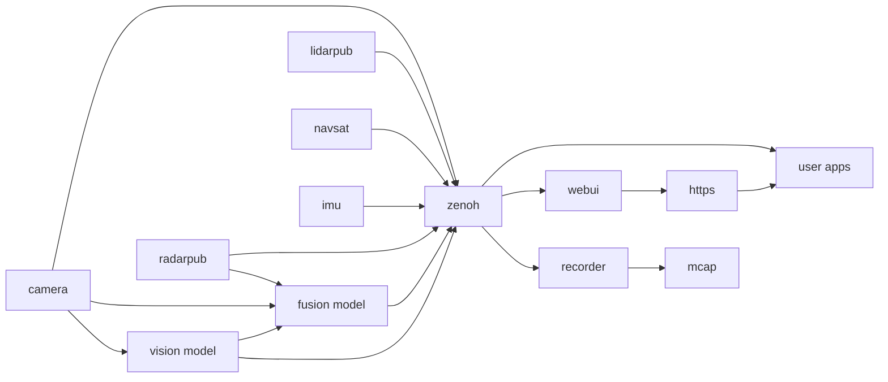

# EdgeFirst Middleware Samples

Repository for the EdgeFirst Middleware samples and demo applications.  The code in this repository is documented on the [EdgeFirst Developer's Guide](https://doc.edgefirst.ai/develop/perception/dev/).  The samples can be run on a target with the EdgeFirst Middleware installed or a remote system connected to such a target.  Refer to the [EdgeFirst Platforms](https://doc.edgefirst.ai/develop/platforms/) for currently support platforms and installation instructions.

The EdgeFirst Middleware is a modular software stack designed as a collection of services communicating over a ROS2-like communication middleware called Zenoh. The various application services are each focused on a general task. For example a camera service is charged with interfacing with the camera and ISP (Image Signal Processor) to efficiently deliver camera frames to other services which require access to the camera. The camera service is also responsible for encoding camera frames using a video codec into H.265 video for efficient recording or remote streaming, this feature of the camera service can be configured or disabled if recording or streaming are not required.

The middleware services communicate with each other using the Zenoh networking middleware which provides a highly efficient publisher/subscriber communications stack. While we do not directly depend on ROS2 the services do encode their messages using the ROS2 CDR (Common Data Representation). The middleware uses the ROS2 standard schemas where applicable and augment them with custom schemas where required. The Recorder and Foxglove chapters go into more detail on how this allows efficient streaming and recording of messages and interoperability with industry standard tools.



Most of the samples are based on subscribing to these topics to receive and handle information.  For example receiving camera frames or model inference results.  While some samples will simply print information on the console the more interesting topics such as the camera require visualization, these samples implement visualization using the [Rerun](https://rerun.io) framework.  This excellent framework allows on-device or remote visualization as well as recording for later playback.  Refer to the [Rerun Documentation](https://rerun.io/docs/getting-started/what-is-rerun) for the full scope of its capabilities.  The [EdgeFirst Developer's Guide](https://doc.edgefirst.ai/develop/perception/dev/) has links to the specific Rerun components being used in the examples to make it easy to learn more about the framework.  Users who wish to use an alternative UI can do so by simply replacing the Rerun portions, there is no special integration beyond the visualizations.  Other examples of intergration are the [MCAP Recorder](https://doc.edgefirst.ai/develop/platforms/recording/) which can record the topics into an [MCAP](https://mcap.dev/) file to be published to [EdgeFirst Studio](https://doc.edgefirst.ai/develop/platforms/publishing/) or viewed within a ROS2 visualizer such as [Foxglove Studio](https://doc.edgefirst.ai/develop/platforms/foxglove/).  Another example would be the Maivin WebUI interface which is implemented using Javascript and HTML and available on the [Maivin WebUI Github](https://github.com/MaivinAI/webui).

## Python

To use the Python examples you will first need a Python installation and to install the dependencies from `requirements.txt` into your Python environment.  Using a Python virtual environment is recommended though not required.

```
pip install -r requirements.txt
```

Python samples are found under `python/...` and sub-folders.  For example the `list-topics` sample can be run as follows.

```
python python/list-topics.py --help
```

## Rust

The Rust code can be found in the `rust` folder with the Cargo configuration in the project root.  You will need a Rust toolchain configured to build applications, and a cross-compiler toolchain if building for a foreign operating system and architecture.  The examples can be run using `cargo run --bin APP` where `APP` is the specific example to run.

```
cargo run --bin list-topics
```

> [!TIP]
> Rust binaries will run significantly faster when built with the `--release` flag, though they will take much longer to compile!

# License

This project is licensed under the AGPL-3.0 or under the terms of the EdgeFirst AI Middleware Commercial License.

# Support

Commercial Support is provided by Au-Zone Technologies through [EdgeFirst Studio](https://edgefirst.ai).
