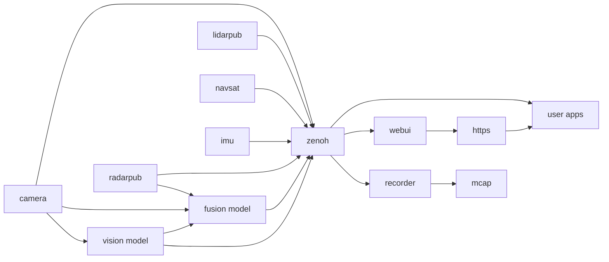

# EdgeFirst Middleware Samples

[](https://github.com/EdgeFirstAI/samples/actions)
[](https://opensource.org/licenses/Apache-2.0)
[](https://edgefirst.studio)

**Learn EdgeFirst Perception Middleware through practical, ready-to-run examples.**

This repository contains sample applications demonstrating how to work with the **EdgeFirst Perception Middleware** for edge AI and computer vision on embedded Linux platforms. Whether you're processing camera streams, LiDAR point clouds, radar data, or fusing multiple sensors, these examples provide clear starting points.

**Quick Links:** [Developer Guide](https://doc.edgefirst.ai/develop/perception/dev/) • [Platform Documentation](https://doc.edgefirst.ai/develop/platforms/) • [Contributing](CONTRIBUTING.md) • [Architecture](ARCHITECTURE.md)

## Features

- **Rust Examples** + **Python Examples** covering:
  - 📷 **Camera:** DMA buffers, H.264/JPEG compression, camera info
  - 🔍 **LiDAR:** Point clouds, depth images, clustering, reflectivity
  - 📡 **Radar:** Target tracking, clustering, range-Doppler-azimuth cubes
  - 🤖 **ML Inference:** 2D/3D bounding boxes, segmentation masks, object tracking
  - 🔗 **Sensor Fusion:** Multi-sensor integration, occupancy grids
  - 🧭 **Navigation:** IMU data, GPS fixes
  
- **Zenoh Middleware** for efficient pub/sub communication
- **Rerun Visualization** (optional) for real-time data inspection
- **ROS2-Compatible** message encoding (CDR serialization)
- **Cross-Platform** Linux, Windows, macOS clients 
- **Zero-Copy** DMA buffer examples for high-performance camera access

## What is EdgeFirst Perception?

The EdgeFirst Middleware is a modular software stack designed as a collection of services communicating over **Zenoh**, a high-performance pub/sub middleware. Each service focuses on a specific task:

- **Camera Service:** Interfaces with cameras and ISPs, delivers frames, handles H.264/H.265 encoding
- **Vision Models:** Runs ML inference for object detection, segmentation, tracking
- **Fusion Service:** Combines data from multiple sensors (camera + LiDAR + radar)
- **Recorder:** Captures topics to MCAP files for EdgeFirst Studio or Foxglove playback

Services communicate using **ROS2 CDR** (Common Data Representation) serialization, ensuring interoperability with standard ROS2 tools while leveraging Zenoh's efficiency.



## Quick Start

> [!NOTE]
> When running on EdgeFirst platforms (Maivin, Raivin) with EdgeFirst Perception active, samples will automatically discover local topics. For remote connections to an EdgeFirst device, use the `--remote <IP:PORT>` argument to connect to the Zenoh endpoint.

### List Available Topics

```bash
# Local (on Maivin/Raivin)
cargo run --bin list-topics

# Remote connection
cargo run --bin list-topics -- --remote 192.168.1.100:7447

# Python
python python/list-topics.py
python python/list-topics.py --remote 192.168.1.100:7447
```

### Subscribe to Camera Stream

```bash
# Rust (with Rerun visualization)
cargo run --bin camera-dma --features rerun --release

# Python
python python/camera/dma.py
```

### View ML Inference Results

```bash
cargo run --bin model-boxes2d --release -- --topic rt/model/boxes2d
```

### Multi-Sensor Fusion Example

```bash
cargo run --bin mega_sample --features rerun --release
```

## Visualization

Most examples support visualization using the [Rerun](https://rerun.io) framework, which provides:

- **On-device or remote** visualization
- **Recording** for later playback (`.rrd` files)
- **Time-series** and spatial data views
- **Multi-sensor** synchronized visualization

Enable Rerun with the `--features rerun` flag when building Rust examples.

Alternative integrations:
- **MCAP Recorder:** Record topics to [MCAP](https://mcap.dev/) files → [Documentation](https://doc.edgefirst.ai/develop/platforms/recording/)
- **Foxglove Studio:** ROS2-compatible visualization → [Guide](https://doc.edgefirst.ai/develop/platforms/foxglove/)
- **EdgeFirst Studio:** Publish recordings for MLOps workflows → [Platform](https://doc.edgefirst.ai/develop/platforms/publishing/)
- **Maivin WebUI:** JavaScript/HTML interface → [GitHub](https://github.com/MaivinAI/webui)

## Installation

### Prerequisites

- **Rust:** 2024 edition (install via [rustup](https://rustup.rs/))
- **Python:** 3.8+ (for Python examples)
- **EdgeFirst Middleware:** Running on target device or accessible remotely
- **Supported Platforms:** Linux, Windows, macOS

### Python Setup

```bash
# Create virtual environment (recommended)
python3 -m venv venv
source venv/bin/activate  # On Windows: venv\Scripts\activate

# Install dependencies
pip install -r requirements.txt

# Run examples
python python/list-topics.py --help
python python/camera/h264.py --topic rt/camera/compressed
```

### Rust Setup

```bash
# Install Rust (if needed)
curl --proto '=https' --tlsv1.2 -sSf https://sh.rustup.rs | sh

# Build all examples
cargo build --release

# Build with Rerun visualization support
cargo build --features rerun --release

# Run specific example
cargo run --bin camera-info --release -- --topic rt/camera/info

# List all available binaries
cargo build --release --bins && ls target/release/ | grep -v "\.d$"
```

> [!TIP]
> Use `--release` for optimized builds (~10x faster runtime, longer compile time)

## Cross-Compilation

Building for embedded ARM platforms from x86_64 development machines:

### ARM64 (aarch64)

```bash
# Add target
rustup target add aarch64-unknown-linux-gnu

# Install cross-compilation toolchain (Ubuntu/Debian)
sudo apt install gcc-aarch64-linux-gnu binutils-aarch64-linux-gnu

# Build
cargo build --target aarch64-unknown-linux-gnu --release

# Or use cross for easier cross-compilation
cargo install cross
cross build --target aarch64-unknown-linux-gnu --release
```

The repository includes `.cargo/config.toml` with pre-configured linker settings.

## Documentation

- **[Architecture Guide](ARCHITECTURE.md)** - In-depth technical overview
- **[Contributing Guidelines](CONTRIBUTING.md)** - How to contribute
- **[Security Policy](SECURITY.md)** - Vulnerability reporting
- **[EdgeFirst Developer Guide](https://doc.edgefirst.ai/develop/perception/dev/)** - Official documentation
- **[Platform Documentation](https://doc.edgefirst.ai/develop/platforms/)** - Supported platforms

## Examples Overview

| Category | Rust Examples | Python Examples | Description |
|----------|---------------|-----------------|-------------|
| **Camera** | `camera-dma`, `camera-h264`, `camera-info` | `camera/dma.py`, `camera/h264.py`, `camera/jpeg.py` | Camera frames, compression, calibration |
| **LiDAR** | `lidar-points`, `lidar-depth`, `lidar-clusters` | `lidar/points.py`, `lidar/depth.py`, `lidar/reflect.py` | Point clouds, depth images, clustering |
| **Radar** | `radar-targets`, `radar-clusters`, `radar-cube` | `radar/targets.py`, `radar/clusters.py` | Target detection, clustering |
| **ML Models** | `model-boxes2d`, `model-mask`, `model-boxes2d-tracked` | `model/boxes2d.py`, `model/mask.py` | Object detection, segmentation, tracking |
| **Fusion** | `fusion-boxes3d`, `fusion-occupancy`, `fusion-lidar` | `fusion/boxes3d.py`, `fusion/occupancy.py` | Multi-sensor data fusion |
| **Navigation** | `imu`, `gps` | `imu.py`, `gps.py` | IMU, GPS data |
| **Combined** | `mega_sample` | `combined/mega_sample.py` | Multi-topic comprehensive example |

## Support

### Community Resources

- **GitHub Discussions:** Ask questions and share ideas
- **GitHub Issues:** Report bugs and request features
- **Documentation:** https://doc.edgefirst.ai/
- **Code of Conduct:** See [CODE_OF_CONDUCT.md](CODE_OF_CONDUCT.md)

### EdgeFirst Ecosystem

- **[EdgeFirst Studio](https://edgefirst.studio):** MLOps platform for edge AI model deployment
- **[EdgeFirst Modules](https://doc.edgefirst.ai/):** Pre-built perception modules
- **Hardware Platforms:**
  - **Maivin:** Edge AI development platform
  - **Raivin:** Automotive-grade edge AI platform

### Commercial Support

Au-Zone Technologies offers commercial support services:

- **Training & Workshops:** EdgeFirst development training
- **Custom Development:** Tailored perception pipelines
- **Integration Services:** Platform-specific integration
- **Enterprise Support:** Priority support and SLAs

**Contact:** support@au-zone.com

## Contributing

We welcome contributions! Please see [CONTRIBUTING.md](CONTRIBUTING.md) for:

- Development setup instructions
- Code style guidelines
- Pull request process
- Testing requirements

All contributors must adhere to our [Code of Conduct](CODE_OF_CONDUCT.md).

## Security

For security vulnerability reports, please see our [Security Policy](SECURITY.md).

**Do not report security issues via public GitHub issues.**

## License

This project is licensed under the **Apache License 2.0** - see [LICENSE](LICENSE) for details.

Copyright © 2025 Au-Zone Technologies. All Rights Reserved.

Third-party dependencies are listed in [NOTICE](NOTICE) with their respective licenses.

## Acknowledgments

Built with:
- [Zenoh](https://zenoh.io/) - High-performance pub/sub middleware
- [Rerun](https://rerun.io/) - Visualization framework
- [Rust](https://www.rust-lang.org/) - Systems programming language
- The EdgeFirst team and open source contributors

---

**EdgeFirst** is a trademark of Au-Zone Technologies.  
For more information, visit https://au-zone.com/
