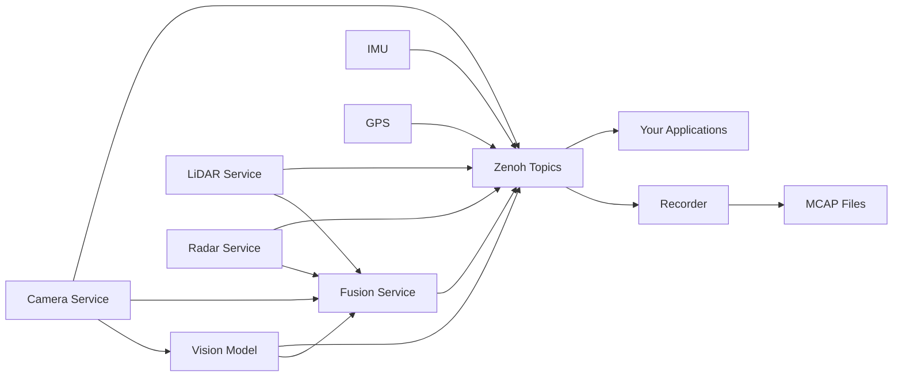

# EdgeFirst Perception Middleware Samples

[](https://github.com/EdgeFirstAI/samples/actions)
[](https://opensource.org/licenses/Apache-2.0)
[](https://edgefirst.studio)

**Ready-to-run examples for working with EdgeFirst Perception Middleware topics.**

This repository provides sample applications demonstrating how to subscribe to and process topics from **EdgeFirst Perception Middleware**—a modular edge AI platform for vision, LiDAR, radar, and sensor fusion on embedded Linux devices.

**Quick Links:** [Developer Guide](https://doc.edgefirst.ai/develop/perception/dev/) • [Latest Release](https://github.com/EdgeFirstAI/samples/releases/latest) • [Contributing](CONTRIBUTING.md)

---

## Quick Start

### Download Pre-Built Binaries

Download the ZIP file for your platform from the [latest release](https://github.com/EdgeFirstAI/samples/releases/latest):

| Platform | Download |
|----------|----------|
| **Linux x86_64** | `edgefirst-samples-linux-x86_64.zip` |
| **Linux aarch64** | `edgefirst-samples-linux-aarch64.zip` |
| **macOS Intel** | `edgefirst-samples-macos-x86_64.zip` |
| **macOS Apple Silicon** | `edgefirst-samples-macos-aarch64.zip` |
| **Windows x86_64** | `edgefirst-samples-windows-x86_64.zip` |

Extract the archive and navigate to the directory:

```bash
unzip edgefirst-samples-linux-x86_64.zip
cd edgefirst-samples-linux-x86_64
```

### Running the Samples

All samples support both **local** (on-device) and **remote** (over network) connections:

```bash
# Local mode - auto-discovers topics on EdgeFirst device
./list-topics

# Remote mode - connect to EdgeFirst device at specific IP:port
./list-topics --remote tcp/192.168.1.100:7447
```

> **Note:** When running remotely, ensure the Zenoh router (`zenohd`) is enabled on the EdgeFirst device with `sudo systemctl enable --now zenohd`.

---

---

## What is EdgeFirst Perception?

The **EdgeFirst Perception Middleware** is a modular software stack for edge AI applications, built as a collection of services communicating over **Zenoh**—a high-performance pub/sub middleware. Each service focuses on a specific task:

- **Camera Service:** Interfaces with cameras and ISPs, delivers raw frames, handles H.264/H.265/JPEG encoding
- **Vision Models:** Runs ML inference for object detection, segmentation, and tracking
- **LiDAR/Radar Services:** Processes point clouds, depth maps, and target tracking
- **Fusion Service:** Combines data from multiple sensors (camera + LiDAR + radar) for 3D scene understanding
- **Recorder:** Captures topics to MCAP files for EdgeFirst Studio or Foxglove playback

Services communicate using **ROS2 CDR** (Common Data Representation) serialization with **Zenoh topics**, ensuring interoperability with ROS2 tools while leveraging Zenoh's efficiency.



These samples demonstrate how to subscribe to EdgeFirst Perception topics, deserialize messages, and process sensor data in your own applications.

---

## Sample Applications

### 🔍 **1. List Topics** - "Hello World" Example

**Purpose:** Discover and display all available topics on an EdgeFirst device.

**Source Code:** [Rust](rust/list-topics.rs) • [Python](python/list_topics.py)

This is the simplest starting point—it connects to the Zenoh network and lists all published topics under the `rt/` namespace. Use this to verify connectivity and see what data sources are available.

**Usage:**
```bash
# Local discovery
./list-topics

# Remote connection
./list-topics --remote tcp/192.168.1.100:7447
```

**Topics Discovered:**
- `rt/camera/image` - Camera frames
- `rt/model/boxes2d` - Object detection results
- `rt/lidar/points` - LiDAR point clouds
- `rt/radar/targets` - Radar detections
- And many more...

---

### 🎥 **2. Mega Sample** - Complete Vision Pipeline Demo

**Purpose:** Demonstrates the core EdgeFirst Perception workflow—live camera feed with real-time object detection and segmentation.

**Source Code:** [Rust](rust/combined/mega_sample.rs) • [Python](python/combined/mega_sample.py)

This is the **most comprehensive example**, showcasing EdgeFirst's edge vision capabilities. It subscribes to multiple topics simultaneously:
- **Camera H.264 stream** (`rt/camera/h264`) - Decodes and displays live video
- **Detection boxes** (`rt/model/boxes2d`) - Overlays bounding boxes on detected objects
- **Segmentation masks** (`rt/model/mask`) - Shows pixel-level classification
- **3D fusion output** (`rt/fusion/boxes3d`) - Multi-sensor 3D object tracking (optional)
- **GPS location** (`rt/gps`) - Device location on map (optional)

**Usage:**
```bash
# Run with Rerun visualization (recommended)
./mega-sample

# Remote connection
./mega-sample --remote tcp/192.168.1.100:7447
```

**What You'll See:**
- Real-time video feed from the camera
- Bounding boxes around detected objects (people, vehicles, etc.)
- Segmentation overlay showing classified regions
- 3D point cloud with fused sensor data (if LiDAR/radar enabled)
- GPS map position (if GPS available)

This example shows the **power of running vision models at the edge**—low-latency ML inference with synchronized multi-sensor fusion, all processed on embedded hardware.

---

### 📷 **3. Camera Examples** - Image Acquisition

**Purpose:** Demonstrate different camera topic subscriptions and image handling methods.

**Why Separate Examples?** While `mega-sample` shows the complete pipeline, these focused examples help you understand camera-specific topics in isolation.

#### Camera DMA (Zero-Copy Buffers)
**Source:** [Rust](rust/camera/dma.rs) • [Python](python/camera/dma.py)  
**Topic:** `rt/camera/dma`  
**Message:** [DmaBuf](https://doc.edgefirst.ai/develop/perception/api/edgefirst_msgs/#dmabuf)

**Linux-only** example showing high-performance zero-copy camera access using DMA buffers. This is the **fastest** way to access camera frames with minimal CPU overhead—ideal for real-time processing.

```bash
./camera-dma  # Must run on EdgeFirst device
```

#### Camera H.264 Stream
**Source:** [Rust](rust/camera/h264.rs) • [Python](python/camera/h264.py)  
**Topic:** `rt/camera/h264`  
**Message:** [CompressedVideo](https://doc.edgefirst.ai/develop/perception/api/foxglove_msgs/#compressedvideo)

Decodes H.264-encoded camera streams. Works remotely and reduces network bandwidth.

```bash
./camera-h264 --remote tcp/192.168.1.100:7447
```

#### Camera Info
**Source:** [Rust](rust/camera/camera_info.rs) • [Python](python/camera/camera_info.py)  
**Topic:** `rt/camera/info`  
**Message:** [CameraInfo](https://doc.edgefirst.ai/develop/perception/api/sensor_msgs/#camerainfo)

Retrieves camera calibration and configuration (resolution, distortion parameters, frame rate).

```bash
./camera-info
```

---

### 🤖 **4. Model Examples** - ML Inference Results

**Purpose:** Subscribe to vision model outputs (object detection, segmentation, tracking).

These examples focus solely on **processing ML inference results** without the camera feed, making it easier to understand model output handling.

#### 2D Bounding Boxes
**Source:** [Rust](rust/model/boxes2d.rs) • [Python](python/model/boxes2d.py)  
**Topic:** `rt/model/boxes2d`  
**Message:** [BoundingBox2DArray](https://doc.edgefirst.ai/develop/perception/api/edgefirst_msgs/#boundingbox2darray)

Displays detected objects with class labels, confidence scores, and bounding box coordinates.

```bash
./model-boxes
```

#### Tracked Objects
**Source:** [Rust](rust/model/boxes2d_tracked.rs) • [Python](python/model/boxes2d_tracked.py)  
**Topic:** `rt/model/boxes2d_tracked`  
**Message:** [BoundingBox2DArray](https://doc.edgefirst.ai/develop/perception/api/edgefirst_msgs/#boundingbox2darray)

Shows object tracking with persistent IDs across frames.

```bash
./model-boxes_tracked
```

#### Segmentation Masks
**Source:** [Rust](rust/model/mask.rs) • [Python](python/model/mask.py)  
**Topic:** `rt/model/mask`  
**Message:** [Mask](https://doc.edgefirst.ai/develop/perception/api/edgefirst_msgs/#mask)

Processes pixel-level semantic segmentation results.

```bash
./model-mask
```

#### Compressed Masks
**Source:** [Rust](rust/model/compressed_mask.rs) • [Python](python/model/compressed_mask.py)  
**Topic:** `rt/model/compressed_mask`  
**Message:** [CompressedMask](https://doc.edgefirst.ai/develop/perception/api/edgefirst_msgs/#compressedmask)

Handles ZSTD-compressed segmentation masks for reduced bandwidth.

```bash
./model-compressed_mask
```

#### Model Info
**Source:** [Rust](rust/model/model_info.rs) • [Python](python/model/model_info.py)  
**Topic:** `rt/model/info`  
**Message:** [ModelInfo](https://doc.edgefirst.ai/develop/perception/api/edgefirst_msgs/#modelinfo)

Retrieves model metadata (name, type, input/output dimensions, class labels).

```bash
./model-info
```

---

### 📡 **5. Radar Examples** - Target Tracking

**Purpose:** Process radar detections, clusters, and range-Doppler-azimuth data.

#### Radar Targets
**Source:** [Rust](rust/radar/targets.rs) • [Python](python/radar/targets.py)  
**Topic:** `rt/radar/targets`  
**Message:** [PointCloud2](https://doc.edgefirst.ai/develop/perception/api/sensor_msgs/#pointcloud2)

Displays detected radar targets as 3D points with velocity information.

```bash
./radar-targets
```

#### Radar Clusters
**Source:** [Rust](rust/radar/clusters.rs) • [Python](python/radar/clusters.py)  
**Topic:** `rt/radar/clusters`  
**Message:** [PointCloud2](https://doc.edgefirst.ai/develop/perception/api/sensor_msgs/#pointcloud2)

Shows clustered radar detections for object-level tracking.

```bash
./radar-clusters
```

#### Radar Cube
**Source:** [Rust](rust/radar/cube.rs) • [Python](python/radar/cube.py)  
**Topic:** `rt/radar/cube`  
**Message:** [RadarCube](https://doc.edgefirst.ai/develop/perception/api/edgefirst_msgs/#radarcube)

Processes raw range-Doppler-azimuth radar cube data.

```bash
./radar-cube
```

#### Radar Info
**Source:** [Rust](rust/radar/info.rs) • [Python](python/radar/info.py)  
**Topic:** `rt/radar/info`  
**Message:** [RadarInfo](https://doc.edgefirst.ai/develop/perception/api/edgefirst_msgs/#radarinfo)

Retrieves radar configuration (range resolution, field of view, update rate).

```bash
./radar-info
```

---

### 🔍 **6. LiDAR Examples** - Point Cloud Processing

**Purpose:** Handle LiDAR point clouds, depth images, and clustering.

#### Point Clouds
**Source:** [Rust](rust/lidar/points.rs) • [Python](python/lidar/points.py)  
**Topic:** `rt/lidar/points`  
**Message:** [PointCloud2](https://doc.edgefirst.ai/develop/perception/api/sensor_msgs/#pointcloud2)

Visualizes 3D LiDAR point clouds.

```bash
./lidar-points
```

#### Depth Images
**Source:** [Rust](rust/lidar/depth.rs) • [Python](python/lidar/depth.py)  
**Topic:** `rt/lidar/depth`  
**Message:** [Image](https://doc.edgefirst.ai/develop/perception/api/sensor_msgs/#image)

Converts LiDAR data to 2D depth map representation.

```bash
./lidar-depth
```

#### LiDAR Clusters
**Source:** [Rust](rust/lidar/clusters.rs) • [Python](python/lidar/clusters.py)  
**Topic:** `rt/lidar/clusters`  
**Message:** [PointCloud2](https://doc.edgefirst.ai/develop/perception/api/sensor_msgs/#pointcloud2)

Shows segmented point cloud clusters (e.g., individual objects or ground plane).

```bash
./lidar-clusters
```

#### Reflectivity
**Source:** [Rust](rust/lidar/reflect.rs) • [Python](python/lidar/reflect.py)  
**Topic:** `rt/lidar/reflect`  
**Message:** [Image](https://doc.edgefirst.ai/develop/perception/api/sensor_msgs/#image)

Displays LiDAR intensity/reflectivity data as a 2D image.

```bash
./lidar-reflect
```

---

### 🔗 **7. Fusion Examples** - Multi-Sensor Integration

**Purpose:** Combine camera, LiDAR, and radar data for comprehensive scene understanding.

#### 3D Bounding Boxes
**Source:** [Rust](rust/fusion/boxes3d.rs) • [Python](python/fusion/boxes3d.py)  
**Topic:** `rt/fusion/boxes3d`  
**Message:** [BoundingBox3DArray](https://doc.edgefirst.ai/develop/perception/api/edgefirst_msgs/#boundingbox3darray)

3D object detections fused from multiple sensors.

```bash
./fusion-boxes3d
```

#### Occupancy Grids
**Source:** [Rust](rust/fusion/occupancy.rs) • [Python](python/fusion/occupancy.py)  
**Topic:** `rt/fusion/occupancy`  
**Message:** [OccupancyGrid](https://doc.edgefirst.ai/develop/perception/api/nav_msgs/#occupancygrid)

2D occupancy map for navigation and obstacle avoidance.

```bash
./fusion-occupancy
```

#### Fused Model Output
**Source:** [Rust](rust/fusion/model_output.rs) • [Python](python/fusion/model_output.py)  
**Topic:** `rt/fusion/model_output`  
**Message:** [Detect](https://doc.edgefirst.ai/develop/perception/api/edgefirst_msgs/#detect)

Combined detection results from vision models and sensor fusion.

```bash
./fusion-model-output
```

#### Fused Radar
**Source:** [Rust](rust/fusion/radar.rs) • [Python](python/fusion/radar.py)  
**Topic:** `rt/fusion/radar`  
**Message:** [PointCloud2](https://doc.edgefirst.ai/develop/perception/api/sensor_msgs/#pointcloud2)

Radar data transformed into camera coordinate frame.

```bash
./fusion-radar
```

#### Fused LiDAR
**Source:** [Rust](rust/fusion/lidar.rs) • [Python](python/fusion/lidar.py)  
**Topic:** `rt/fusion/lidar`  
**Message:** [PointCloud2](https://doc.edgefirst.ai/develop/perception/api/sensor_msgs/#pointcloud2)

LiDAR point cloud projected into camera perspective.

```bash
./fusion-lidar
```

---

### 🧭 **8. Navigation Examples** - IMU and GPS

**Purpose:** Access inertial measurement and positioning data.

#### IMU Data
**Source:** [Rust](rust/imu.rs) • [Python](python/imu.py)  
**Topic:** `rt/imu`  
**Message:** [Imu](https://doc.edgefirst.ai/develop/perception/api/sensor_msgs/#imu)

Reads accelerometer, gyroscope, and orientation data.

```bash
./imu
```

#### GPS Fix
**Source:** [Rust](rust/gps.rs) • [Python](python/gps.py)  
**Topic:** `rt/gps`  
**Message:** [NavSatFix](https://doc.edgefirst.ai/develop/perception/api/sensor_msgs/#navsatfix)

Displays GPS latitude/longitude coordinates and fix quality.

```bash
./gps
```

---

## Visualization

Most examples support visualization using the [Rerun](https://rerun.io) framework, providing:

- **On-device or remote** visualization
- **Recording** for later playback (`.rrd` files)
- **Time-series** and spatial data views
- **Multi-sensor** synchronized visualization

Enable Rerun with the `--features rerun` flag when building Rust examples.

Alternative integrations:
- **MCAP Recorder:** Record topics to [MCAP](https://mcap.dev/) files → [Documentation](https://doc.edgefirst.ai/develop/platforms/recording/)
- **Foxglove Studio:** ROS2-compatible visualization → [Guide](https://doc.edgefirst.ai/develop/platforms/foxglove/)
- **EdgeFirst Studio:** Publish recordings for MLOps workflows → [Platform](https://doc.edgefirst.ai/develop/platforms/publishing/)
- **Maivin WebUI:** JavaScript/HTML interface → [GitHub](https://github.com/MaivinAI/webui)

## Building from Source

### Prerequisites

**Rust:**
```bash
curl --proto '=https' --tlsv1.2 -sSf https://sh.rustup.rs | sh
```

**Python:**
```bash
python3 -m venv venv
source venv/bin/activate  # On Windows: venv\Scripts\activate
pip install -r requirements.txt
```

### Clone and Build

```bash
git clone https://github.com/EdgeFirstAI/samples.git
cd samples

# Build all Rust examples (release mode)
cargo build --release --all-targets

# Build with Rerun visualization support
cargo build --release --all-targets --features rerun

# Run any example
cargo run --bin list-topics --release

# Python examples (no build required)
python python/list_topics.py
```

### Building for Specific Targets

```bash
# Linux aarch64 cross-compilation
rustup target add aarch64-unknown-linux-gnu
cargo build --release --target aarch64-unknown-linux-gnu

# macOS Apple Silicon
cargo build --release --target aarch64-apple-darwin

# Windows
cargo build --release --target x86_64-pc-windows-msvc
```

## Documentation

- **[Architecture Guide](ARCHITECTURE.md)** - In-depth technical overview
- **[Contributing Guidelines](CONTRIBUTING.md)** - How to contribute
- **[Security Policy](SECURITY.md)** - Vulnerability reporting
- **[EdgeFirst Developer Guide](https://doc.edgefirst.ai/develop/perception/dev/)** - Official documentation
- **[Platform Documentation](https://doc.edgefirst.ai/develop/platforms/)** - Supported platforms

## Examples Overview

| Category | Rust Examples | Python Examples | Description |
|----------|---------------|-----------------|-------------|
| **Discovery** | `list-topics` | `list_topics.py` | Topic discovery |
| **Combined** | `mega-sample` | `combined/mega_sample.py` | Complete vision pipeline demo |
| **Camera** | `camera-dma`, `camera-h264`, `camera-info` | `camera/dma.py`, `camera/h264.py`, `camera/camera_info.py` | Camera streams and calibration |
| **ML Models** | `model-boxes`, `model-mask`, `model-boxes_tracked`, `model-info` | `model/boxes2d.py`, `model/mask.py`, `model/boxes2d_tracked.py` | Object detection, segmentation, tracking |
| **Radar** | `radar-targets`, `radar-clusters`, `radar-cube`, `radar-info` | `radar/targets.py`, `radar/clusters.py`, `radar/cube.py` | Radar detections and processing |
| **LiDAR** | `lidar-points`, `lidar-depth`, `lidar-clusters`, `lidar-reflect` | `lidar/points.py`, `lidar/depth.py`, `lidar/clusters.py` | Point clouds and depth imaging |
| **Fusion** | `fusion-boxes3d`, `fusion-occupancy`, `fusion-lidar`, `fusion-radar`, `fusion-model-output` | `fusion/boxes3d.py`, `fusion/occupancy.py`, `fusion/lidar.py` | Multi-sensor integration |
| **Navigation** | `imu`, `gps` | `imu.py`, `gps.py` | Inertial and positioning data |

## Support

### Community Resources

- **GitHub Discussions:** Ask questions and share ideas
- **GitHub Issues:** Report bugs and request features
- **Documentation:** https://doc.edgefirst.ai/
- **Code of Conduct:** See [CODE_OF_CONDUCT.md](CODE_OF_CONDUCT.md)

### EdgeFirst Ecosystem

- **[EdgeFirst Studio](https://edgefirst.studio):** MLOps platform for edge AI model deployment
- **[EdgeFirst Modules](https://doc.edgefirst.ai/):** Pre-built perception modules
- **Hardware Platforms:**
  - **Maivin:** Edge AI development platform
  - **Raivin:** Automotive-grade edge AI platform

### Commercial Support

Au-Zone Technologies offers commercial support services:

- **Training & Workshops:** EdgeFirst development training
- **Custom Development:** Tailored perception pipelines
- **Integration Services:** Platform-specific integration
- **Enterprise Support:** Priority support and SLAs

**Contact:** support@au-zone.com

## Contributing

We welcome contributions! Please see [CONTRIBUTING.md](CONTRIBUTING.md) for:

- Development setup instructions
- Code style guidelines
- Pull request process
- Testing requirements

All contributors must adhere to our [Code of Conduct](CODE_OF_CONDUCT.md).

## Security

For security vulnerability reports, please see our [Security Policy](SECURITY.md).

**Do not report security issues via public GitHub issues.**

## License

This project is licensed under the **Apache License 2.0** - see [LICENSE](LICENSE) for details.

Copyright © 2025 Au-Zone Technologies. All Rights Reserved.

Third-party dependencies are listed in [NOTICE](NOTICE) with their respective licenses.

## Acknowledgments

Built with:
- [Zenoh](https://zenoh.io/) - High-performance pub/sub middleware
- [Rerun](https://rerun.io/) - Visualization framework
- [Rust](https://www.rust-lang.org/) - Systems programming language
- The EdgeFirst team and open source contributors

---

**EdgeFirst** is a trademark of Au-Zone Technologies.  
For more information, visit https://au-zone.com/
