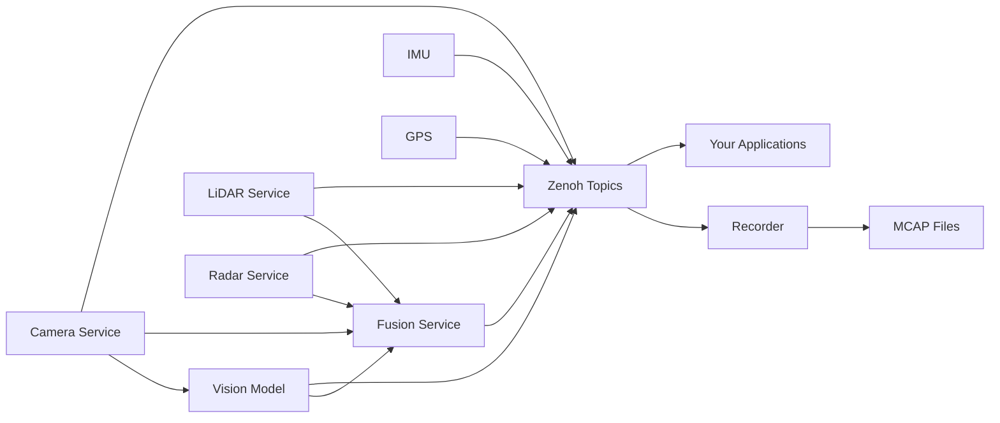
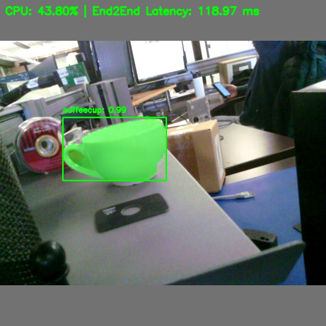
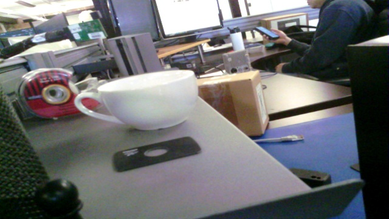
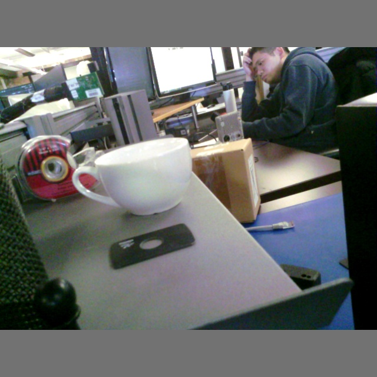
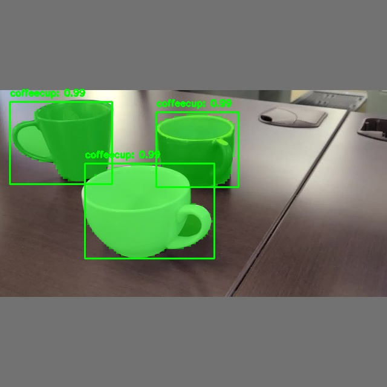
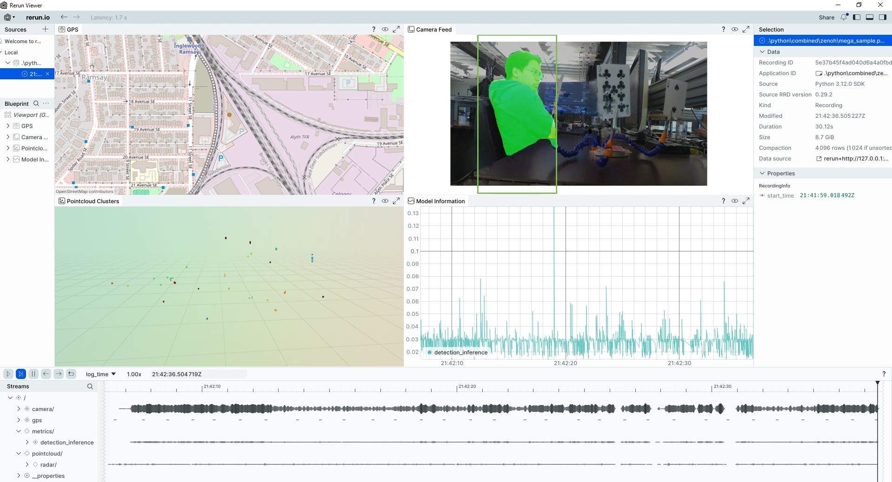

# EdgeFirst Perception Middleware Samples

[](https://github.com/EdgeFirstAI/samples/actions)
[](https://opensource.org/licenses/Apache-2.0)
[](https://edgefirst.studio)

**Ready-to-run examples for working with the end-to-end EdgeFirst pipeline and EdgeFirst Perception Middleware topics.**

This repository contains sample applications that demonstrate the complete EdgeFirst pipeline — from sensor capture and model inference to visualization of results.

The examples are divided into "local" and "zenoh" applications:

* Local applications run natively on the device. They use either [GStreamer](https://gstreamer.freedesktop.org/) or [OpenCV](https://opencv.org/) to capture camera input, load and execute the model for inference, and render the output in a display window.
* Zenoh applications demonstrate how to subscribe to and process topics published by the EdgeFirst Perception Middleware — a modular edge AI platform for vision, LiDAR, radar, and sensor fusion available on EdgeFirst Platforms. These examples use [Zenoh](https://zenoh.io/) for data transport and [Rerun](https://rerun.io/) for visualization.

**Quick Links:** [Developer Guide](https://doc.edgefirst.ai/latest/perception/) • [Latest Release](https://github.com/EdgeFirstAI/samples/releases/latest) • [Contributing](CONTRIBUTING.md)

---

## What is EdgeFirst Perception?

The **EdgeFirst Perception Middleware** is a modular software stack for edge AI applications, built as a collection of services communicating over **Zenoh**—a high-performance pub/sub middleware. Each service focuses on a specific task:

- **Camera Service:** Interfaces with cameras and ISPs, delivers raw frames, handles H.264/H.265/JPEG encoding
- **Vision Models:** Runs ML inference for object detection, segmentation, and tracking
- **LiDAR/Radar Services:** Processes point clouds, depth maps, and target tracking
- **Fusion Service:** Combines data from multiple sensors (camera + LiDAR + radar) for 3D scene understanding
- **Recorder:** Captures topics to MCAP files for EdgeFirst Studio or Foxglove playback

Services communicate using **ROS2 CDR** (Common Data Representation) serialization with **Zenoh topics**, ensuring interoperability with ROS2 tools while leveraging Zenoh's efficiency.


```mermaid
graph LR
    camera[Camera Service] --> model[Vision Model]
    camera --> fusion[Fusion Service]
    lidar[LiDAR Service] --> fusion
    radar[Radar Service] --> fusion
    model --> fusion
    imu[IMU] --> zenoh[Zenoh Topics]
    gps[GPS] --> zenoh
    camera --> zenoh
    model --> zenoh
    fusion --> zenoh
    lidar --> zenoh
    radar --> zenoh
    zenoh --> recorder[Recorder] --> mcap[MCAP Files]
    zenoh --> apps[Your Applications]
```

These "zenoh" samples demonstrate how to subscribe to EdgeFirst Perception topics, deserialize messages, and process sensor data in your own applications.

---

## Building from Source

> Note: the following build instructions were tested using WSL2 with Ubuntu 5.15.

### Prerequisites

**Python:**

> Note: when running the "local" examples, skip these steps since all the libraries needed are already part of the device's BSP. If you plan to use the "zenoh" examples in your PC, proceed to the instructions below.

1. For running the Python "zenoh" examples first install [Python 3.10 or higher](https://www.python.org/downloads/)

2. Once installed, create and activate a [Python virtual environment](https://docs.python.org/3/library/venv.html) and install the requirements

```bash
python3 -m venv venv
source venv/bin/activate  # On Windows: venv\Scripts\activate
pip install -r requirements.txt
```

**Rust:**

1. For building the Rust applications, first install [Rust](https://rust-lang.org/learn/get-started/)

```bash
curl --proto '=https' --tlsv1.2 -sSf https://sh.rustup.rs | sh
```

2. If you have Rust already installed, update to the latest version

```bash
sudo apt update && apt upgrade
rustup update
```

### Clone and Build

```bash
git clone https://github.com/EdgeFirstAI/samples.git
cd samples

# Build all Rust examples (release mode)
cargo build --release --all-targets

# Build with Rerun visualization support
cargo build --release --all-targets --features rerun

# Run any example
cargo run --bin list-topics --release

# Python examples (no build required)
python python/list-topics.py
```

### Building for Specific Targets

```bash
# Linux aarch64 cross-compilation
sudo apt install build-essential
sudo apt install gcc-aarch64-linux-gnu g++-aarch64-linux-gnu
rustup target add aarch64-unknown-linux-gnu
RUSTFLAGS="-C linker=aarch64-linux-gnu-gcc" cargo build --release --target aarch64-unknown-linux-gnu

# macOS Apple Silicon - requires a MAC machine to build
cargo build --release --target aarch64-apple-darwin

# Windows
sudo apt install mingw-w64
rustup target add x86_64-pc-windows-gnu
cargo build --release --target x86_64-pc-windows-gnu
```

---

## Local Examples

Local examples are run in the device to demonstrate how the end-to-end EdgeFirst pipeline is run on target. Currently the local examples are written in Python (*Rust is coming soon*).

1. If you haven't already, clone the repository.

```bash
git clone https://github.com/EdgeFirstAI/samples.git
```

2. Start by copying the samples directory onto the device such as an [i.MX 8M Plus EVK](https://www.nxp.com/products/i.MX8MPLUS) using SCP.

```bash
scp -r ./samples <username>@192.168.1.100:~/
```

> Note: Replace 192.168.1.100 with your device's IP.

3. SSH into the device and cd into the samples directory with `cd samples`.

> Note: For the following applications press CTRL-C on your keyboard to stop.

### 📷 **1. Stream Camera and Display** 

**Purpose:** Demonstrate reading from the camera using either GStreamer or OpenCV.

**Source Code:** Rust(*coming soon*) • [Python](python/camera/local)

**Usage:**

1. Using GStreamer pipelines to stream from the camera

```bash
python3 python/camera/local/gstreamer.py --camera=/dev/video3
```

2. Using OpenCV to stream from the camera

```bash
python3 python/camera/local/opencv.py --camera=/dev/video3
```

**What You'll See:**
- Live camera stream from the monitor
- For opencv.py you will see the CPU usage and the FPS performance `CPU: 43.6%  FPS: 30.0` on the terminal
- For gstreamer.py when enabling `--use-cairo` you will see the CPU usage and the FPS performance `CPU: 46.5%  FPS: 30.0` on the terminal. Otherwise, waylandsink is used in the pipeline, which prevents FPS from being calculated and displayed

> Note: For more information please [README.md](python/camera/README.md)

### 🤖 **2. Model Inference and Display Detections** 

**Purpose:** Demonstrate reading from the camera and invoke the model for inference and display the outputs on the monitor using either GStreamer or OpenCV.

**Source Code:** Rust(*coming soon*) • [Python](python/combined/local/camera_model.py)

**Usage:**

> Note: This example currently only supports quantized Ultralytics TFLite models.

1. Using GStreamer pipelines to stream from the camera and HAL to invoke the model for inference (default)

```bash
python3 -m python.combined.local.camera_model --model /path/my/model.tflite --camera=/dev/video3 
```

2. Using OpenCV to stream from the camera and invoke the model for inference

```bash
python3 -m python.combined.local.camera_model --model /path/my/model.tflite --camera=/dev/video3 --method=opencv
```

**What You'll See:**
- Live camera stream from the monitor with bounding boxes and/or masks around objects detected by the model.
- Performance overlays on the top left corner showing CPU usage and end-to-end latency in milliseconds.



> Note: For more information please [README.md](python/combined/README.md)

### 📷 **3. Letterbox and Resizing Operations using HAL** 

**Purpose:** Demonstrate reading from the camera and perform letterbox or resizing operations on the fetched frames using the [Hardware Abstraction Layer](https://github.com/EdgeFirstAI/hal) (HAL).

**Source Code:** Rust(*coming soon*) • [Python](python/hal/local)

**Usage:**

1. Stream from the camera using GStreamer and resize the frames using HAL (default)

```bash
python -m python.hal.local.resize -s 640x360
```

2. Stream from the camera using OpenCV and resize the frames using OpenCV

```bash
python -m python.hal.local.resize -m opencv -s 640x360
```

3. Stream from the camera using GStreamer and letterbox the frames using HAL (default)

```bash
python -m python.hal.local.letterbox -s 640x640
```

4. Stream from the camera using OpenCV and letterbox the frames using OpenCV

```bash
python -m python.hal.local.letterbox -m opencv -s 640x640
```

**What You'll See:**
- Live camera stream from the monitor with the frame size set to the size specified.
- You will see CPU usage and FPS performance `CPU: 147.4%  FPS: 60.1` on the terminal

| Resized | Letterbox |
|---------|-----------|
|  |  |

> Note: For more information please [README.md](python/hal/README.md)

### 🤖 **4. Single Image Model Inference** 

**Purpose:** Demonstrate a simple application for loading an image and running model inference on the image.

**Source Code:** Rust(*coming soon*) • [Python](python/model/local/tflite.py)

**Usage:**

> Note: This example currently only supports Ultralytics ONNX and TFLite models.

1. Using HAL to load the image and decode model outputs

* ONNX
```bash
python -m python.model.local.onnx --model /path/to/model.onnx --image /path/to/image.jpg
```

* TFLite
```bash
python -m python.model.local.tflite --model /path/to/model.tflite --image /path/to/image.jpg
```

2. Using OpenCV to load the image and decode model outputs

* ONNX
```bash
python -m python.model.local.onnx --model /path/to/model.onnx --image /path/to/image.jpg --method opencv
```

* TFLite
```bash
python -m python.model.local.tflite --model /path/to/model.tflite --image /path/to/image.jpg --method opencv
```

**What You'll See:**
- A list of found objects printed on the terminal as shown below
  ```bash
  Found objects: 3
  - coffeecup: score=0.985 box=[0.02500000037252903, 0.26249998807907104, 0.29374998807907104, 0.48124998807907104]
  - coffeecup: score=0.985 box=[0.4124999940395355, 0.2874999940395355, 0.612500011920929, 0.48750001192092896]
  - coffeecup: score=0.985 box=[0.20000000298023224, 0.42500001192092896, 0.5375000238418579, 0.6625000238418579]
  ```
- When `--save` option is set, an image file will be saved on disk with the output visualizations as shown below.

 

> Note: For more information please [README.md](python/model/README.md)

### 🤖 **5. Model Metadata Extraction** 

**Purpose:** Demonstrate a simple application for extracting model metadata from ONNX or TFLite models trained in [EdgeFirst Studio](https://edgefirst.studio/).

**Source Code:** Rust(*coming soon*) • [Python](python/model/local/metadata.py)

**Usage:**

1. Extract TFLite metadata

```bash
python python/model/local/metadata.py --model /path/to/model.tflite
```

2. Extract ONNX metadata

```bash
python python/model/local/metadata.py --model /path/to/model.onnx
```

**What You'll See:**
- The contents of the metadata will be printed on the terminal.
  ```bash
  Labels: ['coffeecup']
  Model Metadata:
  - host:
          studio_server:
          session: t-2432
          username: sebastien
  - dataset:
          name:
          id: ds-d06
          classes: ['coffeecup']
  - deployment:
          name: coffeecup-yolov8n-seg-rgb
          description:
          author: AuZone Technologies Inc
          model_name: coffeecup-yolov8n-seg-rgb-t-2432
  ...
  ```

> Note: For more information on how the Model Metadata is formatted, see our [documentation](https://doc.edgefirst.ai/latest/models/metadata/)

---

## Zenoh Sample Applications

Zenoh examples requires an [EdgeFirst Platform](https://doc.edgefirst.ai/latest/platforms/) (Maivin or Raivin). These examples can be run either on the PC or on the device. These examples subscribes to [Zenoh](https://zenoh.io/docs/overview/what-is-zenoh/) topics managed by the platform to transmit ROS2 CDR messages over the network. 

> **Note: WSL Native Display**  
> WSL does not provide a native Linux display server by default. If you plan to run the `zenoh` examples inside WSL, you must configure WSL with a working display backend (e.g., WSLg with GPU support).
>
> Install the necessary graphics utilities:
>
> ```bash
> sudo apt install mesa-utils vulkan-tools
> ```
>
> If needed, force Vulkan as the rendering backend:
>
> ```bash
> export WGPU_BACKEND=vulkan
> ```

### Quick Start

Start by downloading the pre-build binaries. Download the ZIP file for your platform from the [latest release](https://github.com/EdgeFirstAI/samples/releases/latest):

| Platform                | Download                               |
|-------------------------|----------------------------------------|
| **Linux x86_64**        | `edgefirst-samples-linux-x86_64.zip`   |
| **Linux aarch64**       | `edgefirst-samples-linux-aarch64.zip`  |
| **macOS Intel**         | `edgefirst-samples-macos-x86_64.zip`   |
| **macOS Apple Silicon** | `edgefirst-samples-macos-aarch64.zip`  | 
| **Windows x86_64**      | `edgefirst-samples-windows-x86_64.zip` |

Extract the archive and navigate to the directory:

```bash
unzip edgefirst-samples-linux-x86_64.zip
cd edgefirst-samples-linux-x86_64
```

All samples support both **local** (on-device) and **remote** (over network) connections:

1. Rust CLI

```bash
# Local mode - auto-discovers topics on EdgeFirst device
./list-topics

# Remote mode - connect to EdgeFirst device at specific IP
./list-topics --remote 192.168.1.100:7447
```

2. Python CLI

```bash
python3 python/list-topics.py # Local mode

python python/list-topics.py --remote 192.168.1.100:7447 # Remote mode
```

> **Note:** When running remotely, ensure the Zenoh router (`zenohd`) is enabled on the EdgeFirst device with `sudo systemctl enable --now zenohd`.

---

### 🔍 **1. List Topics** - "Hello World" Example

**Purpose:** Discover and display all available topics on an EdgeFirst device.

**Source Code:** [Rust](rust/list-topics.rs) • [Python](python/list_topics.py)

This is the simplest starting point—it connects to the Zenoh network and lists all published topics under the `rt/` namespace. Use this to verify connectivity and see what data sources are available.

**Usage:**

1. Rust CLI

```bash
# Local discovery
./list-topics

# Remote connection
./list-topics --remote 192.168.1.100:7447
```

2. Python CLI

```bash
python3 python/list-topics.py

python python/list-topics.py --remote 192.168.1.100:7447
```

**Topics Discovered:**
- `rt/camera/image` - Camera frames
- `rt/model/boxes2d` - Object detection results
- `rt/lidar/points` - LiDAR point clouds
- `rt/radar/targets` - Radar detections
- And many more...

---

### 🎥 **2. Mega Sample** - Complete Vision Pipeline Demo

**Purpose:** Demonstrates the core EdgeFirst Perception workflow—live camera feed with real-time object detection and segmentation.

**Source Code:** [Rust](rust/combined/mega_sample.rs) • [Python](python/combined/zenoh/mega_sample.py)

This is the **most comprehensive example**, showcasing EdgeFirst's edge vision capabilities. It subscribes to multiple topics simultaneously:
- **Camera H.264 stream** (`rt/camera/h264`) - Decodes and displays live video
- **Detection boxes** (`rt/model/boxes2d`) - Overlays bounding boxes on detected objects
- **Segmentation masks** (`rt/model/mask`) - Shows pixel-level classification
- **3D fusion output** (`rt/fusion/boxes3d`) - Multi-sensor 3D object tracking (optional)
- **GPS location** (`rt/gps`) - Device location on map (optional)

**Usage:**

1. Rust CLI

```bash
# Run locally on device with Rerun visualization. This requires a monitor connected to the device.
./mega-sample

# Run on the PC with a monitor and establish a remote connection with the device.
./mega-sample --remote 192.168.1.100:7447
```

2. Python CLI

```bash
# Run locally on device with Rerun visualization. This requires a monitor connected to the device.
python3 python/combined/zenoh/mega_sample.py

# Run on the PC with a monitor and establish a remote connection with the device.
python python/combined/zenoh/mega_sample.py --remote 192.168.1.100:7447
```

As an alternative, if your device is not connected to a monitor, you can direct the visualization towards your PC's monitor by setting up a proxy server.

Run the following command in your PC. You should get the following URL link in the form: `rerun+http://<PC IP address>:9876/proxy`
```bash
rerun --bind <PC IP address>
```

Run the following command in your device.
```bash
# python3 python/combined/zenoh/mega_sample.py --connect --url rerun+http://<PC IP address>:9876/proxy
./mega-sample --connect rerun+http://<PC IP address>:9876/proxy
```

**What You'll See:**
- Real-time video feed from the camera
- Bounding boxes around detected objects (people, vehicles, etc.)
- Segmentation overlay showing classified regions
- 3D point cloud with fused sensor data (if LiDAR/radar enabled)
- GPS map position (if GPS available)



This example shows the **power of running vision models at the edge**—low-latency ML inference with synchronized multi-sensor fusion, all processed on embedded hardware.

> Note: For more information please [README.md](python/combined/README.md)

---

### 📷 **3. Camera Examples** - Image Acquisition

**Purpose:** Demonstrate different camera topic subscriptions and image handling methods.

**Why Separate Examples?** While `mega-sample` shows the complete pipeline, these focused examples help you understand camera-specific topics in isolation.

#### Camera DMA (Zero-Copy Buffers)
**Source:** [Rust](rust/camera/dma.rs) • [Python](python/camera/zenoh/dma.py)  
**Topic:** `rt/camera/dma`  
**Message:** [DmaBuf](https://doc.edgefirst.ai/latest/perception/api/edgefirst_msgs/#dmabuffer)

**Linux-only** example showing high-performance zero-copy camera access using DMA buffers. This is the **fastest** way to access camera frames with minimal CPU overhead—ideal for real-time processing.

1. Rust CLI

```bash
# The following must be run on an EdgeFirst device. This requires a monitor connected to the device.
./camera-dma 
```

2. Python CLI

```bash
# The following must be run on an EdgeFirst device. This requires a monitor connected to the device.
python3 python/camera/zenoh/dma.py
```

As an alternative, if your device is not connected to a monitor, you can direct the visualization towards your PC's monitor by setting up a proxy server.

Run the following command in your PC. You should get the following URL link in the form: `rerun+http://<PC IP address>:9876/proxy`
```bash
rerun --bind <PC IP address>
```

Run the following command in your device.
```bash
# python3 python/camera/zenoh/dma.py --connect --url rerun+http://<PC IP address>:9876/proxy
./camera-dma  --connect --url rerun+http://<PC IP address>:9876/proxy
```

#### Camera H.264 Stream
**Source:** [Rust](rust/camera/h264.rs) • [Python](python/camera/zenoh/h264.py)  
**Topic:** `rt/camera/h264`  
**Message:** [CompressedVideo](https://doc.edgefirst.ai/latest/perception/api/foxglove_msgs/#compressedvideo)

Decodes H.264-encoded camera streams. Works remotely and reduces network bandwidth.

1. Rust CLI

```bash
# Run locally on device with Rerun visualization. This requires a monitor connected to the device.
./camera-h264

# Run on the PC with a monitor and establish a remote connection with the device.
./camera-h264 --remote 192.168.1.100:7447
```

2. Python CLI

```bash
# Run locally on device with Rerun visualization. This requires a monitor connected to the device.
python python/camera/zenoh/h264.py

# Run on the PC with a monitor and establish a remote connection with the device.
python python/camera/zenoh/h264.py --remote 192.168.1.100:7447
```

#### Camera Info
**Source:** [Rust](rust/camera/info.rs) • [Python](python/camera/zenoh/info.py)  
**Topic:** `rt/camera/info`  
**Message:** [CameraInfo](https://doc.edgefirst.ai/latest/perception/api/sensor_msgs/#camerainfo)

Retrieves camera calibration and configuration (resolution, distortion parameters, frame rate).

1. Rust CLI

```bash
# Run locally on device with Rerun visualization. This requires a monitor connected to the device.
./camera-info

# Run on the PC with a monitor and establish a remote connection with the device.
./camera-info --remote 192.168.1.100:7447
```

2. Python CLI

```bash
# Run locally on device with Rerun visualization. This requires a monitor connected to the device.
python python/camera/zenoh/info.py

# Run on the PC with a monitor and establish a remote connection with the device.
python python/camera/zenoh/info.py --remote 192.168.1.100:7447
```

> Note: For more information please [README.md](python/camera/README.md)

---

### 🤖 **4. Model Examples** - ML Inference Results

**Purpose:** Subscribe to vision model outputs (object detection, segmentation, tracking).

These examples focus solely on **processing ML inference results** without the camera feed, making it easier to understand model output handling.

#### 2D Bounding Boxes
**Source:** [Rust](rust/model/boxes2d.rs) • [Python](python/model/zenoh/boxes2d.py)  
**Topic:** `rt/model/boxes2d`  
**Message:** [BoundingBox2DArray](https://doc.edgefirst.ai/latest/perception/api/edgefirst_msgs/#box)

Displays detected objects with class labels, confidence scores, and bounding box coordinates.

1. Rust CLI

```bash
# Run locally on device with Rerun visualization. This requires a monitor connected to the device.
./model-boxes

# Run on the PC with a monitor and establish a remote connection with the device.
./model-boxes --remote 192.168.1.100:7447
```

2. Python CLI

```bash
# Run locally on device with Rerun visualization. This requires a monitor connected to the device.
python python/model/zenoh/boxes2d.py

# Run on the PC with a monitor and establish a remote connection with the device.
python python/model/zenoh/boxes2d.py --remote 192.168.1.100:7447
```

#### Tracked Objects
**Source:** [Rust](rust/model/boxes2d_tracked.rs) • [Python](python/model/zenoh/boxes2d_tracked.py)  
**Topic:** `rt/model/boxes2d_tracked`  
**Message:** [BoundingBox2DArray](https://doc.edgefirst.ai/latest/perception/api/edgefirst_msgs/#box)

Shows object tracking with persistent IDs across frames.

1. Rust CLI

```bash
# Run locally on device with Rerun visualization. This requires a monitor connected to the device.
./model-boxes_tracked

# Run on the PC with a monitor and establish a remote connection with the device.
./model-boxes_tracked --remote 192.168.1.100:7447
```

2. Python CLI

```bash
# Run locally on device with Rerun visualization. This requires a monitor connected to the device.
python python/model/zenoh/boxes2d_tracked.py

# Run on the PC with a monitor and establish a remote connection with the device.
python python/model/zenoh/boxes2d_tracked.py --remote 192.168.1.100:7447
```

#### Segmentation Masks
**Source:** [Rust](rust/model/mask.rs) • [Python](python/model/zenoh/mask.py)  
**Topic:** `rt/model/mask`  
**Message:** [Mask](https://doc.edgefirst.ai/latest/perception/api/edgefirst_msgs/#mask)

Processes pixel-level semantic segmentation results.

1. Rust CLI

```bash
# Run locally on device with Rerun visualization. This requires a monitor connected to the device.
./model-mask

# Run on the PC with a monitor and establish a remote connection with the device.
./model-mask --remote 192.168.1.100:7447
```

2. Python CLI

```bash
# Run locally on device with Rerun visualization. This requires a monitor connected to the device.
python python/model/zenoh/mask.py

# Run on the PC with a monitor and establish a remote connection with the device.
python python/model/zenoh/mask.py --remote 192.168.1.100:7447
```

#### Compressed Masks
**Source:** [Rust](rust/model/compressed_mask.rs) • [Python](python/model/zenoh/compressed_mask.py)  
**Topic:** `rt/model/compressed_mask`  
**Message:** [CompressedMask](https://doc.edgefirst.ai/latest/perception/api/edgefirst_msgs/#compressedmask)

Handles ZSTD-compressed segmentation masks for reduced bandwidth.

1. Rust CLI

```bash
# Run locally on device with Rerun visualization. This requires a monitor connected to the device.
./model-compressed_mask

# Run on the PC with a monitor and establish a remote connection with the device.
./model-compressed_mask --remote 192.168.1.100:7447
```

2. Python CLI

```bash
# Run locally on device with Rerun visualization. This requires a monitor connected to the device.
python python/model/zenoh/compressed_mask.py

# Run on the PC with a monitor and establish a remote connection with the device.
python python/model/zenoh/compressed_mask.py --remote 192.168.1.100:7447
```

#### Model Info
**Source:** [Rust](rust/model/model_info.rs) • [Python](python/model/zenoh/model_info.py)  
**Topic:** `rt/model/info`  
**Message:** [ModelInfo](https://doc.edgefirst.ai/latest/perception/api/edgefirst_msgs/#modelinfo)

Retrieves model metadata (name, type, input/output dimensions, class labels).

1. Rust CLI

```bash
# Run locally on device with Rerun visualization. This requires a monitor connected to the device.
./model-info

# Run on the PC with a monitor and establish a remote connection with the device.
./model-info --remote 192.168.1.100:7447
```

2. Python CLI

```bash
# Run locally on device with Rerun visualization. This requires a monitor connected to the device.
python python/model/zenoh/model_info.py

# Run on the PC with a monitor and establish a remote connection with the device.
python python/model/zenoh/model_info.py --remote 192.168.1.100:7447
```

> Note: For more information please [README.md](python/model/README.md)

---

### 📡 **5. Radar Examples** - Target Tracking

**Purpose:** Process radar detections, clusters, and range-Doppler-azimuth data.

#### Radar Targets
**Source:** [Rust](rust/radar/targets.rs) • [Python](python/radar/zenoh/targets.py)  
**Topic:** `rt/radar/targets`  
**Message:** [PointCloud2](https://doc.edgefirst.ai/latest/perception/api/sensor_msgs/#pointcloud2)

Displays detected radar targets as 3D points with velocity information.

1. Rust CLI

```bash
# Run locally on device with Rerun visualization. This requires a monitor connected to the device.
./radar-targets

# Run on the PC with a monitor and establish a remote connection with the device.
./radar-targets --remote 192.168.1.100:7447
```

2. Python CLI

```bash
# Run locally on device with Rerun visualization. This requires a monitor connected to the device.
python python/radar/zenoh/targets.py

# Run on the PC with a monitor and establish a remote connection with the device.
python python/radar/zenoh/targets.py --remote 192.168.1.100:7447
```

#### Radar Clusters
**Source:** [Rust](rust/radar/clusters.rs) • [Python](python/radar/zenoh/clusters.py)  
**Topic:** `rt/radar/clusters`  
**Message:** [PointCloud2](https://doc.edgefirst.ai/latest/perception/api/sensor_msgs/#pointcloud2)

Shows clustered radar detections for object-level tracking.

1. Rust CLI

```bash
# Run locally on device with Rerun visualization. This requires a monitor connected to the device.
./radar-clusters

# Run on the PC with a monitor and establish a remote connection with the device.
./radar-clusters --remote 192.168.1.100:7447
```

2. Python CLI

```bash
# Run locally on device with Rerun visualization. This requires a monitor connected to the device.
python python/radar/zenoh/clusters.py

# Run on the PC with a monitor and establish a remote connection with the device.
python python/radar/zenoh/clusters.py --remote 192.168.1.100:7447
```

#### Radar Cube
**Source:** [Rust](rust/radar/cube.rs) • [Python](python/radar/zenoh/cube.py)  
**Topic:** `rt/radar/cube`  
**Message:** [RadarCube](https://doc.edgefirst.ai/latest/perception/api/edgefirst_msgs/#radarcube)

Processes raw range-Doppler-azimuth radar cube data.

1. Rust CLI

```bash
# Run locally on device with Rerun visualization. This requires a monitor connected to the device.
./radar-cube

# Run on the PC with a monitor and establish a remote connection with the device.
./radar-cube --remote 192.168.1.100:7447
```

2. Python CLI

```bash
# Run locally on device with Rerun visualization. This requires a monitor connected to the device.
python python/radar/zenoh/cube.py

# Run on the PC with a monitor and establish a remote connection with the device.
python python/radar/zenoh/cube.py --remote 192.168.1.100:7447
```

#### Radar Info
**Source:** [Rust](rust/radar/info.rs) • [Python](python/radar/zenoh/info.py)  
**Topic:** `rt/radar/info`  
**Message:** [RadarInfo](https://doc.edgefirst.ai/latest/perception/api/edgefirst_msgs/#radarinfo)

Retrieves radar configuration (range resolution, field of view, update rate).

1. Rust CLI

```bash
# Run locally on device with Rerun visualization. This requires a monitor connected to the device.
./radar-info

# Run on the PC with a monitor and establish a remote connection with the device.
./radar-info --remote 192.168.1.100:7447
```

2. Python CLI

```bash
# Run locally on device with Rerun visualization. This requires a monitor connected to the device.
python python/radar/zenoh/info.py

# Run on the PC with a monitor and establish a remote connection with the device.
python python/radar/zenoh/info.py --remote 192.168.1.100:7447
```

---

### 🔍 **6. LiDAR Examples** - Point Cloud Processing

**Purpose:** Handle LiDAR point clouds, depth images, and clustering.

#### Point Clouds
**Source:** [Rust](rust/lidar/points.rs) • [Python](python/lidar/zenoh/points.py)  
**Topic:** `rt/lidar/points`  
**Message:** [PointCloud2](https://doc.edgefirst.ai/latest/perception/api/sensor_msgs/#pointcloud2)

Visualizes 3D LiDAR point clouds.

1. Rust CLI

```bash
# Run locally on device with Rerun visualization. This requires a monitor connected to the device.
./lidar-points

# Run on the PC with a monitor and establish a remote connection with the device.
./lidar-points --remote 192.168.1.100:7447
```

2. Python CLI

```bash
# Run locally on device with Rerun visualization. This requires a monitor connected to the device.
python python/lidar/zenoh/points.py

# Run on the PC with a monitor and establish a remote connection with the device.
python python/lidar/zenoh/points.py --remote 192.168.1.100:7447
```

#### Depth Images
**Source:** [Rust](rust/lidar/depth.rs) • [Python](python/lidar/zenoh/depth.py)  
**Topic:** `rt/lidar/depth`  
**Message:** [Image](https://doc.edgefirst.ai/latest/perception/api/sensor_msgs/#image)

Converts LiDAR data to 2D depth map representation.

1. Rust CLI

```bash
# Run locally on device with Rerun visualization. This requires a monitor connected to the device.
./lidar-depth

# Run on the PC with a monitor and establish a remote connection with the device.
./lidar-depth --remote 192.168.1.100:7447
```

2. Python CLI

```bash
# Run locally on device with Rerun visualization. This requires a monitor connected to the device.
python python/lidar/zenoh/depth.py

# Run on the PC with a monitor and establish a remote connection with the device.
python python/lidar/zenoh/depth.py --remote 192.168.1.100:7447
```

#### LiDAR Clusters
**Source:** [Rust](rust/lidar/clusters.rs) • [Python](python/lidar/zenoh/clusters.py)  
**Topic:** `rt/lidar/clusters`  
**Message:** [PointCloud2](https://doc.edgefirst.ai/latest/perception/api/sensor_msgs/#pointcloud2)

Shows segmented point cloud clusters (e.g., individual objects or ground plane).

1. Rust CLI

```bash
# Run locally on device with Rerun visualization. This requires a monitor connected to the device.
./lidar-clusters

# Run on the PC with a monitor and establish a remote connection with the device.
./lidar-clusters --remote 192.168.1.100:7447
```

2. Python CLI

```bash
# Run locally on device with Rerun visualization. This requires a monitor connected to the device.
python python/lidar/zenoh/clusters.py

# Run on the PC with a monitor and establish a remote connection with the device.
python python/lidar/zenoh/clusters.py --remote 192.168.1.100:7447
```

#### Reflectivity
**Source:** [Rust](rust/lidar/reflect.rs) • [Python](python/lidar/zenoh/reflect.py)  
**Topic:** `rt/lidar/reflect`  
**Message:** [Image](https://doc.edgefirst.ai/latest/perception/api/sensor_msgs/#image)

Displays LiDAR intensity/reflectivity data as a 2D image.

1. Rust CLI

```bash
# Run locally on device with Rerun visualization. This requires a monitor connected to the device.
./lidar-reflect

# Run on the PC with a monitor and establish a remote connection with the device.
./lidar-reflect --remote 192.168.1.100:7447
```

2. Python CLI

```bash
# Run locally on device with Rerun visualization. This requires a monitor connected to the device.
python python/lidar/zenoh/reflect.py

# Run on the PC with a monitor and establish a remote connection with the device.
python python/lidar/zenoh/reflect.py --remote 192.168.1.100:7447
```

---

### 🔗 **7. Fusion Examples** - Multi-Sensor Integration

**Purpose:** Combine camera, LiDAR, and radar data for comprehensive scene understanding.

#### 3D Bounding Boxes
**Source:** [Rust](rust/fusion/boxes3d.rs) • [Python](python/fusion/zenoh/boxes3d.py)  
**Topic:** `rt/fusion/boxes3d`  
**Message:** [BoundingBox3DArray](https://doc.edgefirst.ai/latest/perception/api/edgefirst_msgs/#boundingbox3darray)

3D object detections fused from multiple sensors.

1. Rust CLI

```bash
# Run locally on device with Rerun visualization. This requires a monitor connected to the device.
./fusion-boxes3d

# Run on the PC with a monitor and establish a remote connection with the device.
./fusion-boxes3d --remote 192.168.1.100:7447
```

2. Python CLI

```bash
# Run locally on device with Rerun visualization. This requires a monitor connected to the device.
python python/fusion/zenoh/boxes3d.py

# Run on the PC with a monitor and establish a remote connection with the device.
python python/fusion/zenoh/boxes3d.py --remote 192.168.1.100:7447
```

#### Occupancy Grids
**Source:** [Rust](rust/fusion/occupancy.rs) • [Python](python/fusion/zenoh/occupancy.py)  
**Topic:** `rt/fusion/occupancy`  
**Message:** [OccupancyGrid](https://doc.edgefirst.ai/latest/perception/api/nav_msgs/#occupancygrid)

2D occupancy map for navigation and obstacle avoidance.

1. Rust CLI

```bash
# Run locally on device with Rerun visualization. This requires a monitor connected to the device.
./fusion-occupancy

# Run on the PC with a monitor and establish a remote connection with the device.
./fusion-occupancy --remote 192.168.1.100:7447
```

2. Python CLI

```bash
# Run locally on device with Rerun visualization. This requires a monitor connected to the device.
python python/fusion/zenoh/occupancy.py

# Run on the PC with a monitor and establish a remote connection with the device.
python python/fusion/zenoh/occupancy.py --remote 192.168.1.100:7447
```

#### Fused Model Output
**Source:** [Rust](rust/fusion/model_output.rs) • [Python](python/fusion/zenoh/model_output.py)  
**Topic:** `rt/fusion/model_output`  
**Message:** [Detect](https://doc.edgefirst.ai/latest/perception/api/edgefirst_msgs/#detect)

Combined detection results from vision models and sensor fusion.

1. Rust CLI

```bash
# Run locally on device with Rerun visualization. This requires a monitor connected to the device.
./fusion-model-output

# Run on the PC with a monitor and establish a remote connection with the device.
./fusion-model-output --remote 192.168.1.100:7447
```

2. Python CLI

```bash
# Run locally on device with Rerun visualization. This requires a monitor connected to the device.
python python/fusion/zenoh/model_output.py

# Run on the PC with a monitor and establish a remote connection with the device.
python python/fusion/zenoh/model_output.py --remote 192.168.1.100:7447
```

#### Fused Radar
**Source:** [Rust](rust/fusion/radar.rs) • [Python](python/fusion/zenoh/radar.py)  
**Topic:** `rt/fusion/radar`  
**Message:** [PointCloud2](https://doc.edgefirst.ai/latest/perception/api/sensor_msgs/#pointcloud2)

Radar data transformed into camera coordinate frame.

1. Rust CLI

```bash
# Run locally on device with Rerun visualization. This requires a monitor connected to the device.
./fusion-radar

# Run on the PC with a monitor and establish a remote connection with the device.
./fusion-radar --remote 192.168.1.100:7447
```

2. Python CLI

```bash
# Run locally on device with Rerun visualization. This requires a monitor connected to the device.
python python/fusion/zenoh/radar.py

# Run on the PC with a monitor and establish a remote connection with the device.
python python/fusion/zenoh/radar.py --remote 192.168.1.100:7447
```

#### Fused LiDAR
**Source:** [Rust](rust/fusion/lidar.rs) • [Python](python/fusion/zenoh/lidar.py)  
**Topic:** `rt/fusion/lidar`  
**Message:** [PointCloud2](https://doc.edgefirst.ai/latest/perception/api/sensor_msgs/#pointcloud2)

LiDAR point cloud projected into camera perspective.

1. Rust CLI

```bash
# Run locally on device with Rerun visualization. This requires a monitor connected to the device.
./fusion-lidar

# Run on the PC with a monitor and establish a remote connection with the device.
./fusion-lidar --remote 192.168.1.100:7447
```

2. Python CLI

```bash
# Run locally on device with Rerun visualization. This requires a monitor connected to the device.
python python/fusion/zenoh/lidar.py

# Run on the PC with a monitor and establish a remote connection with the device.
python python/fusion/zenoh/lidar.py --remote 192.168.1.100:7447
```

---

### 🧭 **8. Navigation Examples** - IMU and GPS

**Purpose:** Access inertial measurement and positioning data.

#### IMU Data
**Source:** [Rust](rust/imu.rs) • [Python](python/imu.py)  
**Topic:** `rt/imu`  
**Message:** [Imu](https://doc.edgefirst.ai/latest/perception/api/sensor_msgs/#imu)

Reads accelerometer, gyroscope, and orientation data.

1. Rust CLI

```bash
# Run locally on device with Rerun visualization. This requires a monitor connected to the device.
./imu

# Run on the PC with a monitor and establish a remote connection with the device.
./imu --remote 192.168.1.100:7447
```

2. Python CLI

```bash
# Run locally on device with Rerun visualization. This requires a monitor connected to the device.
python python/imu.py

# Run on the PC with a monitor and establish a remote connection with the device.
python python/imu.py --remote 192.168.1.100:7447
```

#### GPS Fix
**Source:** [Rust](rust/gps.rs) • [Python](python/gps.py)  
**Topic:** `rt/gps`  
**Message:** [NavSatFix](https://doc.edgefirst.ai/latest/perception/api/sensor_msgs/#navsatfix)

Displays GPS latitude/longitude coordinates and fix quality.

1. Rust CLI

```bash
# Run locally on device with Rerun visualization. This requires a monitor connected to the device.
./gps

# Run on the PC with a monitor and establish a remote connection with the device.
./gps --remote 192.168.1.100:7447
```

2. Python CLI

```bash
# Run locally on device with Rerun visualization. This requires a monitor connected to the device.
python python/gps.py

# Run on the PC with a monitor and establish a remote connection with the device.
python python/gps.py --remote 192.168.1.100:7447
```

---

## Visualization

Most examples support visualization using the [Rerun](https://rerun.io) framework, providing:

- **On-device or remote** visualization
- **Recording** for later playback (`.rrd` files)
- **Time-series** and spatial data views
- **Multi-sensor** synchronized visualization

Enable Rerun with the `--features rerun` flag when building Rust examples.

Alternative integrations:
- **MCAP Recorder:** Record topics to [MCAP](https://mcap.dev/) files → [Documentation](https://doc.edgefirst.ai/develop/platforms/recording/)
- **Foxglove Studio:** ROS2-compatible visualization → [Guide](https://doc.edgefirst.ai/develop/platforms/foxglove/)
- **EdgeFirst Studio:** Publish recordings for MLOps workflows → [Platform](https://doc.edgefirst.ai/develop/platforms/publishing/)
- **Maivin WebUI:** JavaScript/HTML interface → [GitHub](https://github.com/MaivinAI/webui)

## Examples Overview

| Category | Rust Examples | Python Examples | Description |
|----------|---------------|-----------------|-------------|
| **Discovery** | `list-topics` | `list_topics.py` | Topic discovery |
| **Combined** | `mega-sample` | `combined/mega_sample.py` | Complete vision pipeline demo |
| **Camera** | `camera-dma`, `camera-h264`, `camera-info` | `camera/dma.py`, `camera/h264.py`, `camera/camera_info.py` | Camera streams and calibration |
| **ML Models** | `model-boxes`, `model-mask`, `model-boxes_tracked`, `model-info` | `model/boxes2d.py`, `model/mask.py`, `model/boxes2d_tracked.py` | Object detection, segmentation, tracking |
| **Radar** | `radar-targets`, `radar-clusters`, `radar-cube`, `radar-info` | `radar/targets.py`, `radar/clusters.py`, `radar/cube.py` | Radar detections and processing |
| **LiDAR** | `lidar-points`, `lidar-depth`, `lidar-clusters`, `lidar-reflect` | `lidar/points.py`, `lidar/depth.py`, `lidar/clusters.py` | Point clouds and depth imaging |
| **Fusion** | `fusion-boxes3d`, `fusion-occupancy`, `fusion-lidar`, `fusion-radar`, `fusion-model-output` | `fusion/boxes3d.py`, `fusion/occupancy.py`, `fusion/lidar.py` | Multi-sensor integration |
| **Navigation** | `imu`, `gps` | `imu.py`, `gps.py` | Inertial and positioning data |

## Extra Reading Material

- **[Architecture Guide](ARCHITECTURE.md)** - In-depth technical overview
- **[Contributing Guidelines](CONTRIBUTING.md)** - How to contribute
- **[Security Policy](SECURITY.md)** - Vulnerability reporting
- **[EdgeFirst Developer Guide](https://doc.edgefirst.ai/latest/perception/dev/)** - Official documentation
- **[Platform Documentation](https://doc.edgefirst.ai/latest/platforms/)** - Supported platforms

## Support

### Community Resources

- **GitHub Discussions:** Ask questions and share ideas
- **GitHub Issues:** Report bugs and request features
- **Documentation:** https://doc.edgefirst.ai/
- **Code of Conduct:** See [CODE_OF_CONDUCT.md](CODE_OF_CONDUCT.md)

### EdgeFirst Ecosystem

- **[EdgeFirst Studio](https://edgefirst.studio):** MLOps platform for edge AI model deployment
- **[EdgeFirst Modules](https://doc.edgefirst.ai/):** Pre-built perception modules
- **[Hardware Platforms](https://doc.edgefirst.ai/latest/platforms/):**
  - **Maivin:** Edge AI development platform
  - **Raivin:** Automotive-grade edge AI platform

### Commercial Support

Au-Zone Technologies offers commercial support services:

- **Training & Workshops:** EdgeFirst development training
- **Custom Development:** Tailored perception pipelines
- **Integration Services:** Platform-specific integration
- **Enterprise Support:** Priority support and SLAs

**Contact:** support@au-zone.com

## Contributing

We welcome contributions! Please see [CONTRIBUTING.md](CONTRIBUTING.md) for:

- Development setup instructions
- Code style guidelines
- Pull request process
- Testing requirements

All contributors must adhere to our [Code of Conduct](CODE_OF_CONDUCT.md).

## Security

For security vulnerability reports, please see our [Security Policy](SECURITY.md).

**Do not report security issues via public GitHub issues.**

## License

This project is licensed under the **Apache License 2.0** - see [LICENSE](LICENSE) for details.

Copyright © 2025 Au-Zone Technologies. All Rights Reserved.

Third-party dependencies are listed in [NOTICE](NOTICE) with their respective licenses.

## Acknowledgments

Built with:
- [Zenoh](https://zenoh.io/) - High-performance pub/sub middleware
- [Rerun](https://rerun.io/) - Visualization framework
- [GStreamer](https://gstreamer.freedesktop.org/) - Pipeline-based multimedia framework
- [OpenCV](https://opencv.org/) - Open source computer vision
- [Ultralytics](https://www.ultralytics.com/) - Open source AI framework for training YOLO models
- [Rust](https://www.rust-lang.org/) - Systems programming language
- [Python](https://www.python.org/) - General purpose programming language
- The EdgeFirst team and open source contributors

---

**EdgeFirst** is a trademark of Au-Zone Technologies.  
For more information, visit https://au-zone.com/
