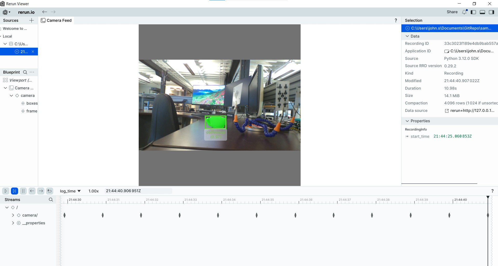

# EdgeFirst Perception Middleware HAL Samples

This section provides sample applications that demonstrate using EdgeFirst HAL
for image preprocessing (letterbox/resize), DMA access, and model output
decoding. The **local** examples run on-device and focus on HAL preprocessing
pipelines, while the **zenoh** directory shows examples for subscribing to
Zenoh topics hosted by an [EdgeFirst Platform](https://doc.edgefirst.ai/latest/platforms/).

> Note: For any of these programs press CTRL-C to quit.

## Local Examples

The following examples are intended to run locally on an EdgeFirst device.

### **1. Resize (HAL / OpenCV / Pillow)**

**Purpose:** Demonstrate resizing with HAL (default), OpenCV, or Pillow for comparison.

**Source Code:** [Python - HAL](python/hal/local/resize_hal.py) • [Python - OpenCV](python/hal/local/resize_opencv.py)

**Usage:**

The following shows resizing the frame to a 16x9 aspect ratio.

1. HAL resize:
```bash
python python/hal/local/resize_hal.py -s 640x360
```

2. OpenCV resize:
```bash
python python/hal/local/resize_opencv.py -s 640x360
```

3. Pillow resize:
```bash
python python/hal/local/resize_opencv.py -m pillow -s 640x360
```

### **2. Letterbox (HAL)**

**Purpose:** Demonstrate letterbox preprocessing using HAL.

**Source Code:** [Python - HAL](python/hal/local/letterbox_hal.py) • [Python - OpenCV](python/hal/local/letterbox_opencv.py)

**Usage:**

1. HAL letterbox:
```bash
python python/hal/local/letterbox_hal.py -s 640x640
```

2. OpenCV letterbox:
```bash
python python/hal/local/letterbox_opencv.py -s 640x640
```

3. Pillow letterbox:
```bash
python python/hal/local/letterbox_opencv.py -m pillow -s 640x640
```

## Zenoh Examples

These examples are only supported in [EdgeFirst Platforms](https://doc.edgefirst.ai/latest/platforms/) such as the Maivin or Raivin. These platforms publish data in Zenoh (ROS-like) topics which are unique to these platforms where other devices can then use to subscribe and receive data.

These examples can be run with an EdgeFirst Platform with the Zenoh, camera, and model services enabled.

`sudo systemctl enable --now zenohd`
`sudo systemctl enable --now camera`
`sudo systemctl enable --now model`

### **1. DMA (Zenoh + HAL)**

**Purpose:** Subscribes to Zenoh DMA topics (e.g. `rt/camera/dma`) to demonstrate direct DMA buffer access and visualization.

**Source Code:** [Python](python/hal/zenoh/dma.py)

**Usage:**

> Note: this sample can only run in EdgeFirst Platforms either locally or via a proxy server as shown below.

1. Run locally on an EdgeFirst Platform (DMA is local-only):
```bash
python python/hal/zenoh/dma.py
```

2. Connect via proxy server

Run the following command in your PC. You should get the following URL link in the form: `rerun+http://<PC IP address>:9876/proxy`
```bash
rerun --bind <PC IP address>
```

Run the following command in your EdgeFirst Platform:
```bash
python python/hal/zenoh/dma.py --connect --url rerun+http://<PC IP address>:9876/proxy
```

### **2. Decoder (Zenoh + HAL)**

**Purpose:** Subscribes to Zenoh camera topics, runs YOLO ONNX or TFLite for inference, decodes model outputs, and visualizes results in Rerun.

**Source Code:** [Python](python/hal/zenoh/decoder.py)

**Usage:**

1. Connect remotely with an EdgeFirst Platform:
```bash
python python/hal/zenoh/decoder.py --model /path/to/model.onnx --remote 192.168.1.100:7447
```

2. Connect via proxy server

Run the following command in your PC. You should get the following URL link in the form: `rerun+http://<PC IP address>:9876/proxy`
```bash
rerun --bind <PC IP address>
```

Run the following command in your EdgeFirst Platform:
```bash
python python/hal/zenoh/decoder.py --model /path/to/model.onnx --connect --url rerun+http://<PC IP address>:9876/proxy
```

**What you'll see**
- A rerun visualization showing the frame and the decoded model outputs (boxes, masks, labels) drawn on the frame.



### **3. Resize and Letterbox (Zenoh + HAL)**

**Purpose:** Subscribes to Zenoh camera topics, applies HAL resize/rotation, and visualizes the transformed frames in Rerun.

**Source Code:** [Python](python/hal/zenoh/resize.py)

**Usage:**

1. Connect remotely with an EdgeFirst Platform:

* Resize
```bash
python python/hal/zenoh/resize.py --remote 192.168.1.100:7447
```

* Letterbox
```bash
python python/hal/zenoh/letterbox.py --remote 192.168.1.100:7447
```

2. Connect via proxy server

Run the following command in your PC. You should get the following URL link in the form: `rerun+http://<PC IP address>:9876/proxy`
```bash
rerun --bind <PC IP address>
```

Run the following command in your EdgeFirst Platform:

* Resize
```bash
python python/hal/zenoh/resize.py --connect --url rerun+http://<PC IP address>:9876/proxy
```

* Letterbox
```bash
python python/hal/zenoh/letterbox.py --connect --url rerun+http://<PC IP address>:9876/proxy
```

### **4. Tracking (Zenoh + HAL)**

**Purpose:** Subscribes to Zenoh camera topics, runs YOLO inference, and tracks detections across frames.

**Source Code:** [Python](python/hal/zenoh/tracking.py)

**Usage:**

1. Connect remotely with an EdgeFirst Platform:
```bash
python python/hal/zenoh/tracking.py --model /path/to/model.onnx --remote 192.168.1.100:7447
```

2. Connect via proxy server

Run the following command in your PC. You should get the following URL link in the form: `rerun+http://<PC IP address>:9876/proxy`
```bash
rerun --bind <PC IP address>
```

Run the following command in your EdgeFirst Platform:
```bash
python python/hal/zenoh/tracking.py --model /path/to/model.onnx --connect --url rerun+http://<PC IP address>:9876/proxy
```
